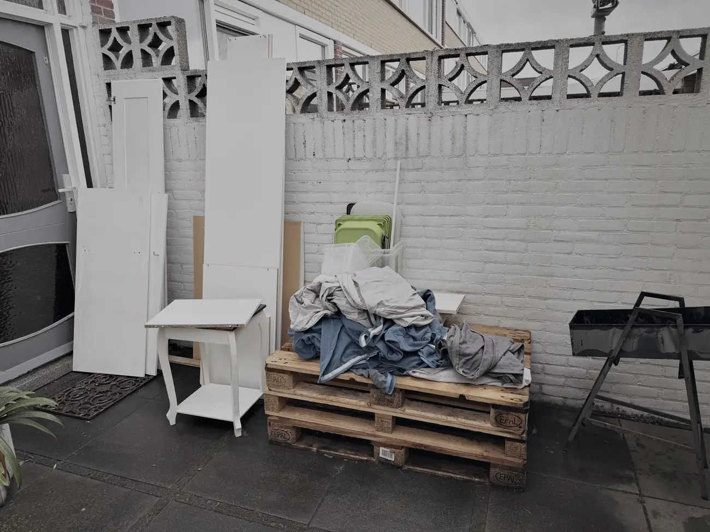
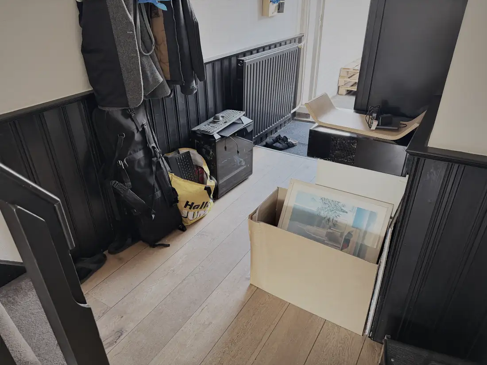
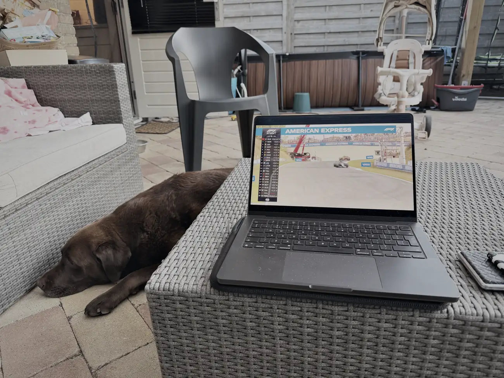

Bas is altijd vroeg wakker. Zes uur, dan sta je. Korte nachtjes dus.

Gisteravond hebben Jeff en Bas hier geslapen en hebben we een plan de campagne gemaakt. Vanmorgen vroeg begonnen met het slopen van de kasten. Eerste ritje van de dag: de vuilstort.

Daarna hadden we trek. Boodschappen gedaan en onszelf getrakteerd op wat lekkere snacks. Rond half één kwam Deveny ook nog even helpen.

Spullen uitgezocht. Wat naar Jeff gaat staat in de gang, hij heeft ook nog even tussen mijn boeken gekeken of er wat voor hem bij zat. De bus opnieuw volgegooid. Bas was ondertussen druk met LEGO. Daar heb je weinig hulp aan, maar wel gezellig, en bij ome Wesley op bezoek komen wordt straks een stuk lastiger.

Rond een uur of vijf waren we behoorlijk naar de conjo van al die trappen en dat gesjouw. Toch nog richting Brabant gereden om alles wat daar achterblijft weer uit te laden. Eten besteld, want koken zag niemand meer zitten.

Volgens mijn telefoon: 53 verdiepingen en ruim vijftienduizend stappen. Ik heb nu pijn aan spieren waarvan ik niet wist dat ik ze had.

Vanavond nog even de kwalificatie gekeken met een biertje en een sigaret. Morgen terug naar Monster voor Zandvoort.

Twee dagen geleden zag ik door de bomen het bos niet meer. Vandaag wel.
