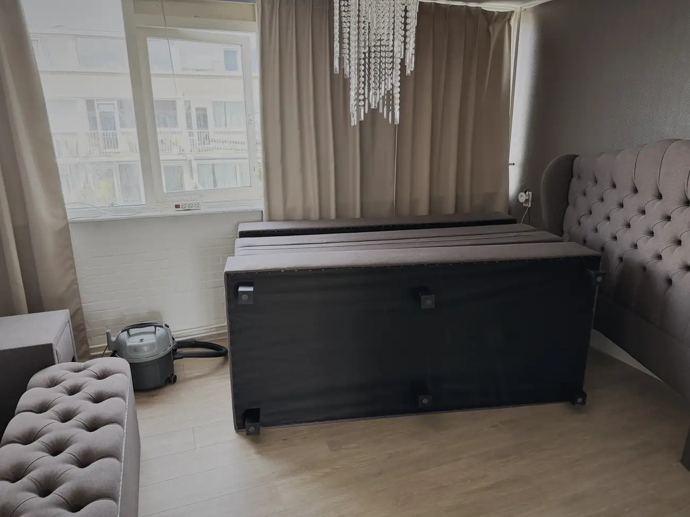
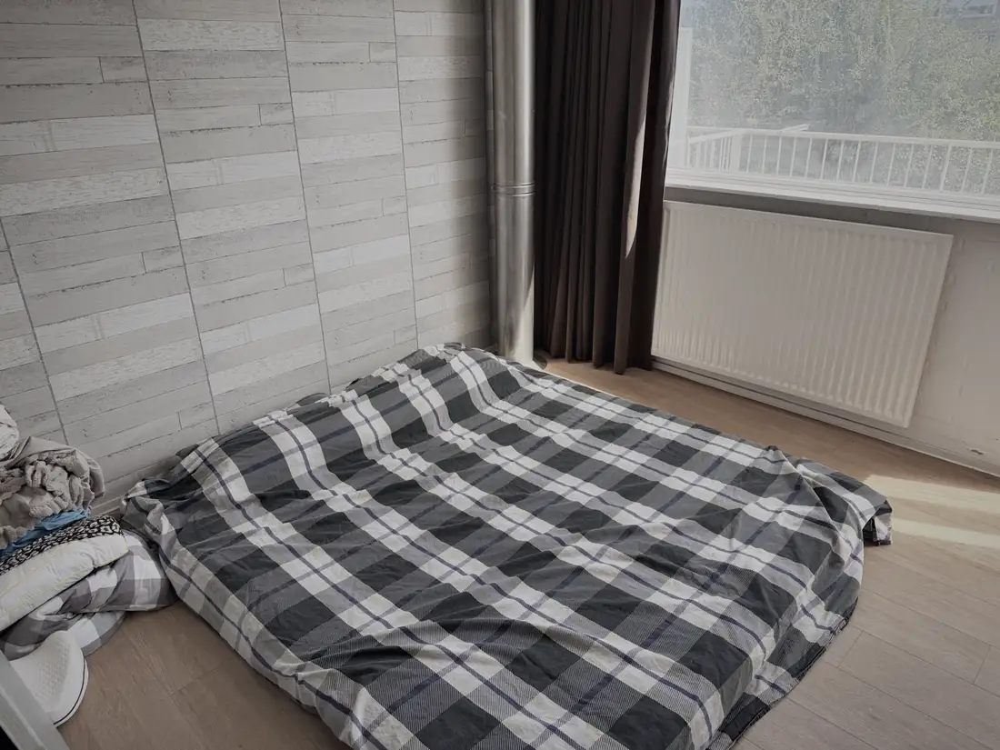
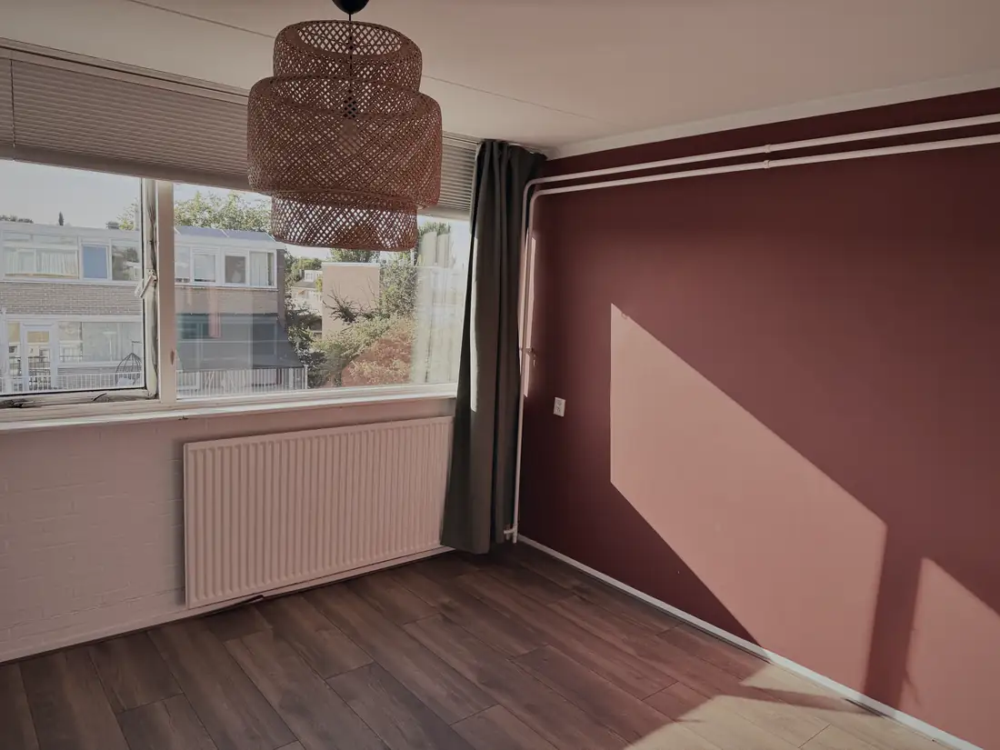
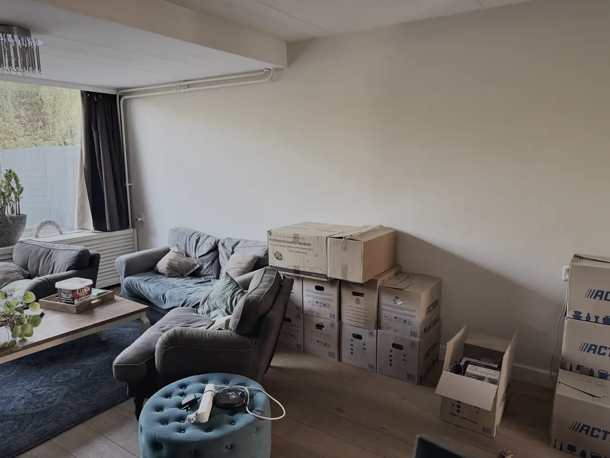
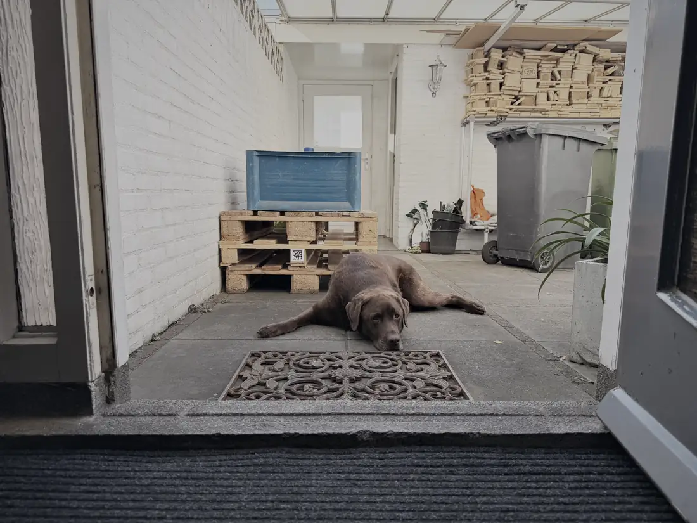

Verkocht. Morgen komen ze hem halen met een busje.

Het hoofdbord moet via het balkon naar beneden, want dat ding is zo gigantisch dat hij niet door het trappengat past. Naar boven is hij ook nooit als geheel gegaan, dus dat wisten we. En dan maar hopen dat hij bij die mensen in de lift past.

Het doet wel een beetje pijn. Ik heb er heerlijk op geslapen. Maar meenemen naar Spanje is haast niet te doen vanwege de omvang. Dan zit de bus meteen vol en moet ik een extra rit heen en terug maken voor een bed. Voor die kosten koop ik daar net zo goed een nieuwe.

Mijn topper gaat wel mee. Die ligt nu op de grond in de werkkamer, want die is inmiddels omgebouwd tot tijdelijke slaapkamer. Daar slaap ik de laatste weken in dit huis.

De werkkamer is leeg. De sportkamer is leeg. De logeerkamer is leeg. En de woonkamer wordt met de dag voller, want daar komt alles terecht wat nog mee moet of nog weg moet.

Mo ligt in de voortuin. Die heeft er geen enkele moeite mee.

Ik hoop dat die mensen in Rijswijk er net zo lekker op gaan slapen als ik heb gedaan.
