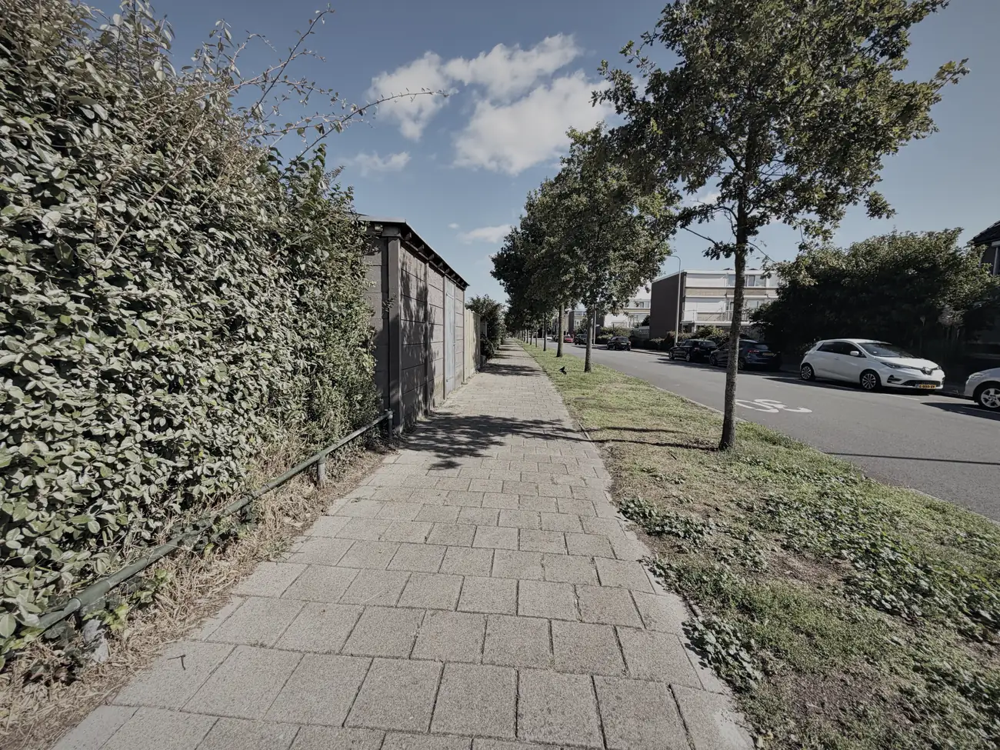
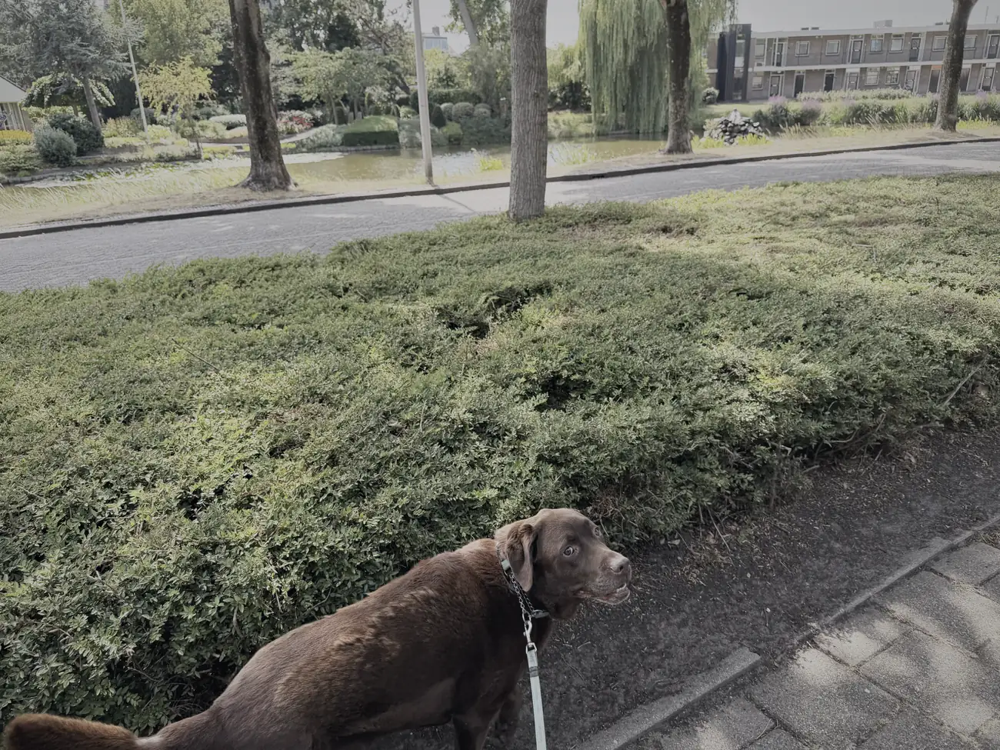
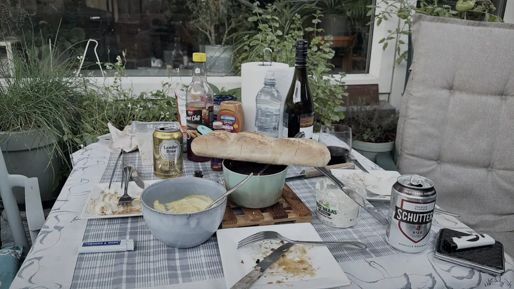
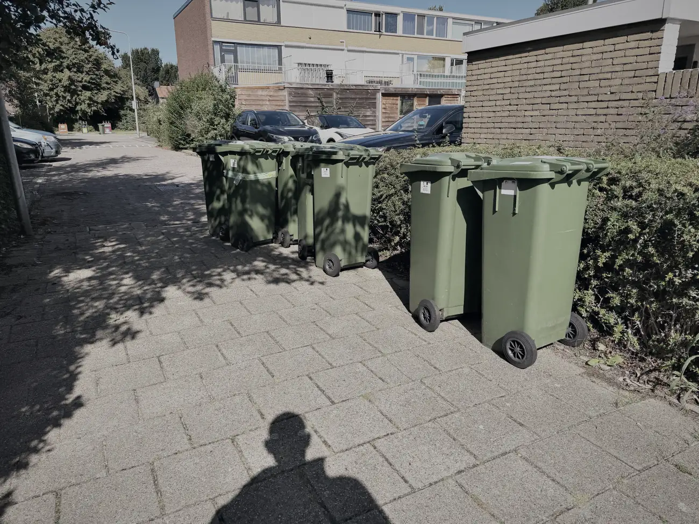
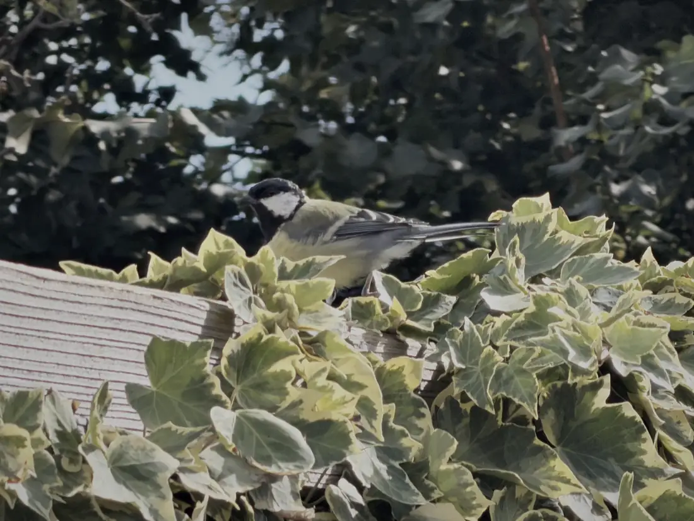

Het begon een tijdje terug, tijdens een ochtendrondje met Mo. Langs de begraafplaats, het tennispark en de Rubenslaan. Ik liep daar en dacht: dit rondje doe ik nog maar dertig keer.

Vanaf dat moment ben ik overal laatste keren gaan zien.

Gisteravond belde ik een vriendin terug. Ze had me 's middags gebeld maar ik nam niet op, want ik was met Ron de wasmachine naar beneden aan het tillen.

Ron was bijna vijftien jaar mijn werkgever. Inmiddels is hij een van mijn beste vrienden, iemand met wie ik alles kan delen. De wasmachine ging naar zijn dochter in Zoetermeer, en daarna heb ik bij Ron en Cynt gegeten.

Toen ik die vriendin terugbelde zei ze: ja, ik dacht, misschien kom ik vandaag bij je eten. Want misschien is het wel de laatste keer.

En dat is precies de fase waar ik nu in zit.

De laatste keer barbecueën bij Joost. Het laatste etentje met Ed en Chantal. De laatste keer eten bij Ron en Cynt. De laatste keer dat rondje met Mo. De laatste keer lopen naar de supermarkt. De laatste keer de groenbak buiten zetten.

De laatste keer het vogeltje mijn vogelhuisje in zien vliegen.

Sommige daarvan komen terug. Ik ga nog vaak genoeg naar Nederland en die etentjes komen er heus wel weer. Maar dat vogeltje ga ik niet meer zien, en daar kan ik niks aan doen.

Als vrienden vragen hoe het gaat, zeg ik eigenlijk best goed. Het huis is bijna leeg, ik heb overzicht, en dat geeft rust.

Maar die laatste keertjes zitten vandaag wel in mijn hoofd.
