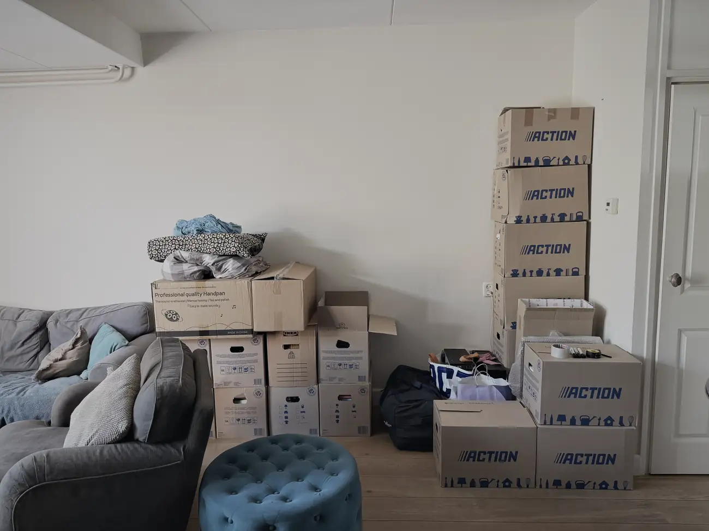
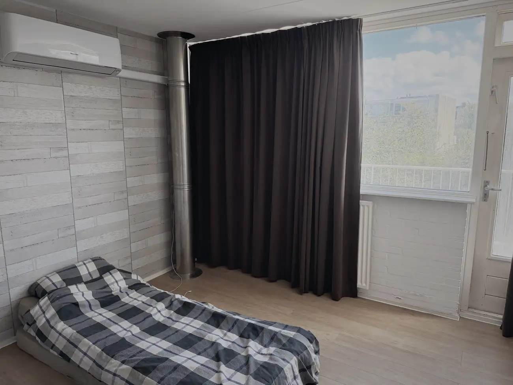
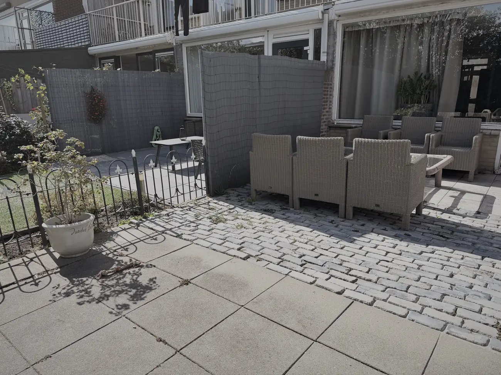
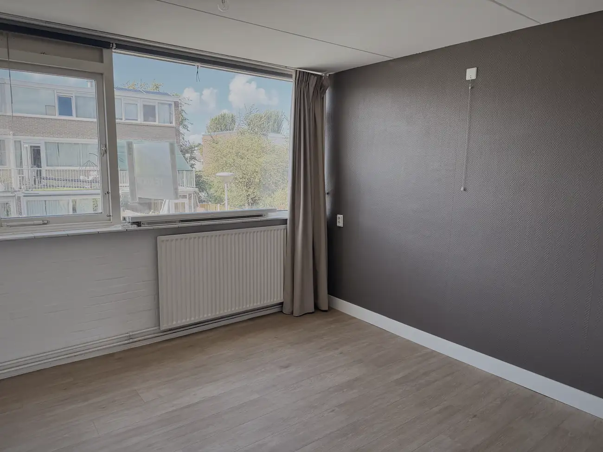

Vannacht slaap ik hier voor de laatste keer op een zaterdag. Volgende week zaterdag gaat de laatste lading naar het grofvuil, dan de bus in en dan rijd ik naar mijn broertje in Hoeven. Vanaf 12 september slaap ik hier niet meer.

Dat is een gek idee.

De afgelopen dagen ben ik vooral aan het ruimen geweest. Lampen van het plafond, de wasmachine verhuisd, de keuken uitgezocht. Het begint nu echt op te schieten, maar ik heb me wel vergist in hoeveel werk het is. Het meeste doe ik alleen. Dat is niet erg, het hoort erbij, en ik zit er wel lekker in.

Wassen kan niet meer, dus mijn vuile was verzamel ik in tassen. Wat een armoede. En dat slapen op de grond begint nu echt als kamperen te voelen.

Volgende week wordt er weer een hoop opgehaald. De schouw en de lampen gaan naar een vriendin, net als de eettafelstoelen en nog wat spullen. Die laatste week wordt dus echt kamperen. Komt goed. Rustaghhh.

Dat zei ik vandaag ook tegen Hans en Anita, mijn buren. Ze riepen me vanuit de tuin en vroegen hoe het ging. Na een uitgebreid verhaal over waar ik nu sta en waar ik heen ga, kwamen zij met hun nieuws: morgen gaan ze op vakantie. We zien elkaar dus waarschijnlijk niet meer.

Die kwam even binnen.

Ik woon hier bijna tien jaar en ik heb altijd een goede band met ze gehad. Ze stonden altijd voor me klaar. We stapten regelmatig spontaan bij elkaar over het hekje voor een bakkie of een biertje.

We hebben vandaag wat oude herinneringen opgehaald. Zoals die keer dat we met z'n allen in een zwembadje in mijn tuin zaten, toen hun kinderen nog thuis woonden. IJskoud water, bloedheet weer, en wat hebben we daar zitten gieren.

En Oud en Nieuw. Ik ben mijn hele leven al gek op vuurwerk en dat heeft in deze straat voor de nodige herinneringen gezorgd. Ik kwam altijd aanzetten met sierpotten. Van die potten die vijf minuten lang de hele straat verlichten, heavy shit. Daar had heel Monster plezier van.

Met de jaarwisseling van 2017 op 2018 ging het mis. Hans wist het nog precies. Hij zat op de bank, ik zat op de wc, en toen hoorden we een enorme klap. De ramen en de deuren trilden en niemand wist wat het was.

Ik ben altijd voorzichtig met vuurwerk en had alles wat ik had afgestoken diezelfde avond al opgeruimd in zakken. Op één doos na. Die doe ik morgen wel, dacht ik. En wat denk je? Uitgerekend van dat ding was één component niet afgegaan, en er waren kinderen met vuurpijlen aan het spelen in die pot.

Politie aan de deur, alles erop en eraan. Ik heb me daar knap beroerd over gevoeld en mijn les wel geleerd. Gelukkig was er geen letsel, maar de schrik zat er goed in.

Even terug in het hier en nu. Ik ga jullie missen, Hans en Anita. Bedankt voor alles.

Vanavond ga ik nog één keer uit eten met mijn beste maat Joost. Ook dat wordt een bittere pil, maar we maken er het beste van.

Natuurlijk hou ik met iedereen contact en kom ik nog geregeld buurten in Nederland. De straat ga ik eerlijk gezegd niet missen. De mensen die dicht bij me staan wel, en dat doet zeer.
