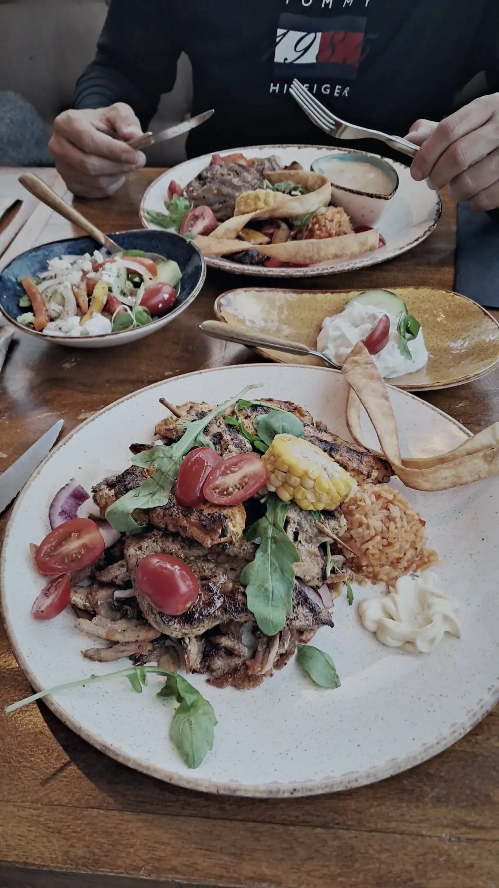
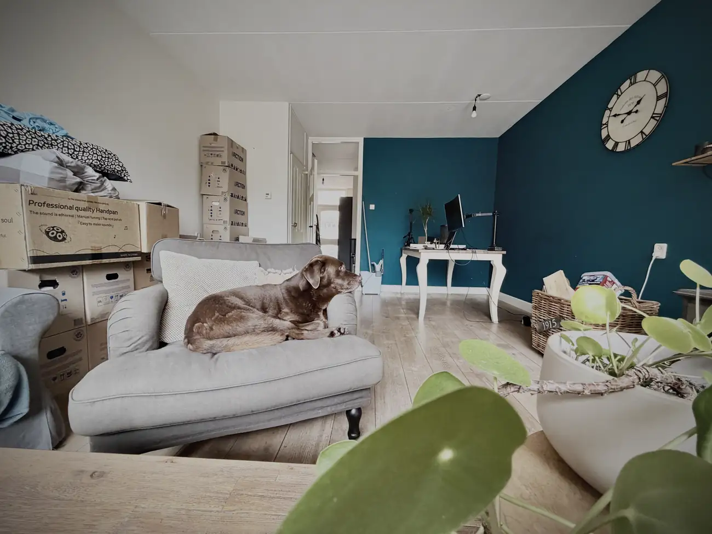
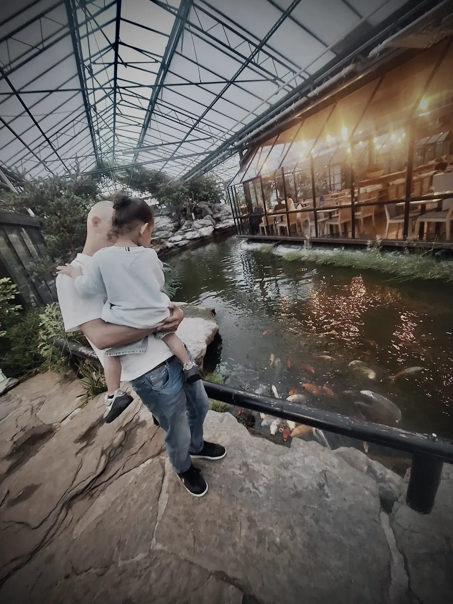
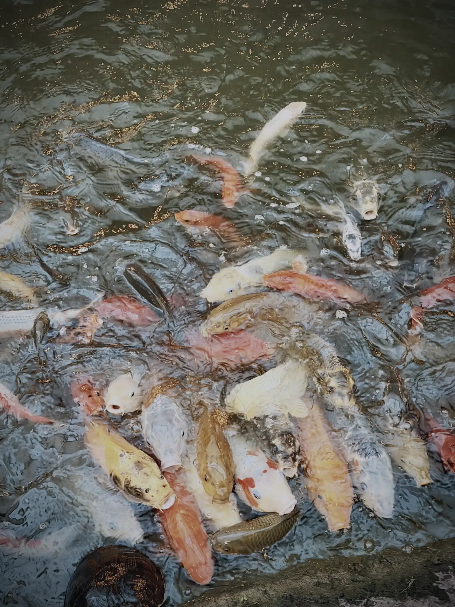
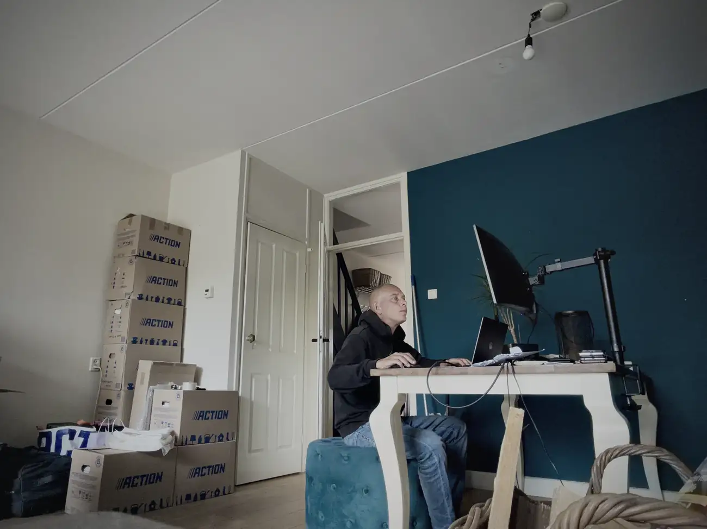
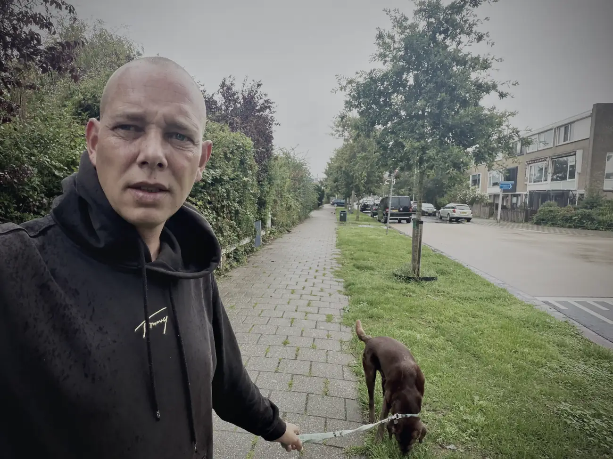

Afgelopen zaterdag was mijn laatste zaterdag in dit huis. Ik ben met mijn beste maat Joost naar de Griek geweest.

Ik hou van Joost, maar wij zijn een slecht duo. Het probleem is dat we allebei geen ruggengraat hebben en elkaar nooit kunnen motiveren om verstandig met onze gewoontes om te gaan. We hebben geen rem, en dan gaan de ouzo's hard.

Zondag koppijn en spijt, zoals altijd na een avondje doorzakken. Ik leer het ook nooit. Maar het was het me dik en dubbel waard.

Joost, vriend. Wij hebben een band die met geen pen te beschrijven is. En we kennen elkaar niet eens zo lang, maar wat hebben wij veel gedeeld in die jaren.

Weet je nog dat we naar België op vakantie gingen en jij zuinig moest zijn op de tent? Dat ging de eerste paar dagen goed. Maar na een paar dagen kamperen en bier besloot jij op jacht te gaan met een nerfpistool, op een vlieg op de koelbox. Wat hebben we toen in onze broek gezeken van het lachen. Daar heb ik trouwens nog bewijs van.

<a class="deel-knop mono" href="https://www.tiktok.com/@wesleyvaders/video/7255764286755097882" target="_blank" rel="noopener">Het bewijs staat op TikTok</a>

Pas je goed op jezelf als ik straks weg ben? Chakra Wesley, zo sta ik nog steeds in je telefoon, gaat je na die ene chakra healing nooit meer vergeten en houdt je vanuit Spanje goed in de gaten. Ik zie, hoor, voel en weet bijna alles. Dat weet jij.

Amigo, ik ga onze doorzakavonden missen. En de diepe gesprekken, de eerlijke en pittige discussies, F1 op zondag en je lach. Ouwe flat earther. We will meet again.

Nadat ik zondag mijn roes had uitgeslapen, heb ik 's middags nog één keer in dit huis een Formule 1-race gekeken. Eindelijk wat sensatie op de baan in Monza. Ik ben die avond vroeg het mandje in gegaan en was maandag gelukkig weer het mannetje. Ik ben 's avonds een vent en 's ochtends lekker uitslapen, en zo heb ik ook deze zondag weer overleefd.

Maandag kwam Linda langs voor de eetkamerstoelen. Even een bakkie gedaan en bijgebabbeld. Volgens mij heb jij bewust een kleinere auto gekocht, Lin, zodat je vandaag nog een keer langs kon komen voor de laatste twee.

Linda en ik kennen elkaar nog niet zo lang. Zij kwam vaak bij mijn vader over de vloer na het overlijden van mijn moeder in 2021. We hebben vandaag wat herinneringen opgehaald en lekker zweverige gesprekken gevoerd.

Lin, ik wil je heel erg bedanken voor alles wat je voor mijn vader hebt gedaan. Ik weet hoe moeilijk jij die laatste fase vond, maar je bleef komen. Dat vergeet ik nooit. Je komt een bakkie doen in Spanje, hè?

Maandagavond ben ik met Shir en haar kleine naar de Watertuin in Naaldwijk geweest. Ik kon even geen Griek meer zien, dus bedacht ik wat anders, ook leuk voor haar zoontje.

Helaas is die tent wat verpauperd, daar schrok ik van. Zo'n mooie locatie met zo veel potentieel. Jammer. Maar je eet daar tussen de koi, en dat vond die kleine geweldig. We hebben nog een rondje gelopen en de vissen gevoerd. Er viel meer voer op de grond dan in het water, maar dat mocht de pret niet drukken. Die herinnering pakken ze ons niet meer af.

Shir en ik hebben elkaar leren kennen op de hypno-opleiding, waar zij assistent-docent was. We hebben elkaar daarna nooit meer losgelaten. Al zit daar wel een gebruiksaanwijzing bij.

Wat hebben wij uren aan de telefoon gezeten. Tegelijk zaten we dan te gamen, Fallout en Green Hell. Heel wat uurtjes gespeeld en gebeld. We hadden vaak "twee uurtjes", want dan verbrak de verbinding automatisch. Soms hadden we twee keer twee uurtjes achter elkaar.

En dat was niet altijd even gezellig. Wie mij een beetje kent weet dat ik weinig geduld heb en alles snel wil doen. Shir is precies het tegenovergestelde en kon minutenlang een boom of een paddenstoel staan hypnotiseren, terwijl ik allang uit het zicht was. Waarom loop jij zo snel, kreeg ik dan voor mijn kiezen. En ik maar denken: schiet toch op, mens.

De discussies liepen soms zo hoog op dat we elkaar dagen niet spraken. En als we allebei waren afgekoeld, kwam het vanzelf weer goed.

Alles komt goed, alles is al goed. Die woorden hebben wij vaak naar elkaar uitgesproken. Ik ga je missen, meis, gebruiksaanwijzing en al.

Vandaag ben ik bezig geweest met de keuken schoonmaken. Linda heeft de laatste twee stoelen opgehaald en ik zit nu aan de eettafel te werken, op een poef.

Steeds een stapje dichterbij, en ik ben er nu wel klaar voor. Waar ik tegenaan loop is tijd. Iedereen wil nog afspreken en in mijn hoofd wil ik nog bij veel mensen langs, maar ik raak in gevecht met de klok. Ik ben heel ver met het huis, en dat maakt me moe als kantoorpikkie, maar tijd voor leuke dingen wordt schaars.

Mo heeft er allemaal geen last van. Die heeft nog geen idee waar hij over een paar weken allemaal naartoe gaat, en dat hij hier nooit meer terugkomt.

Nou Motje, ik beloof je: je bent nu acht, en je gaat me dankbaar zijn voor wat we samen gaan meemaken. Samen kunnen wij de wereld aan.

Bedankt voor je tijd en aandacht. Laat gerust een berichtje achter als je het tot het einde hebt gered. Dat motiveert me om door te gaan met bloggen, en misschien straks wel vloggen.
