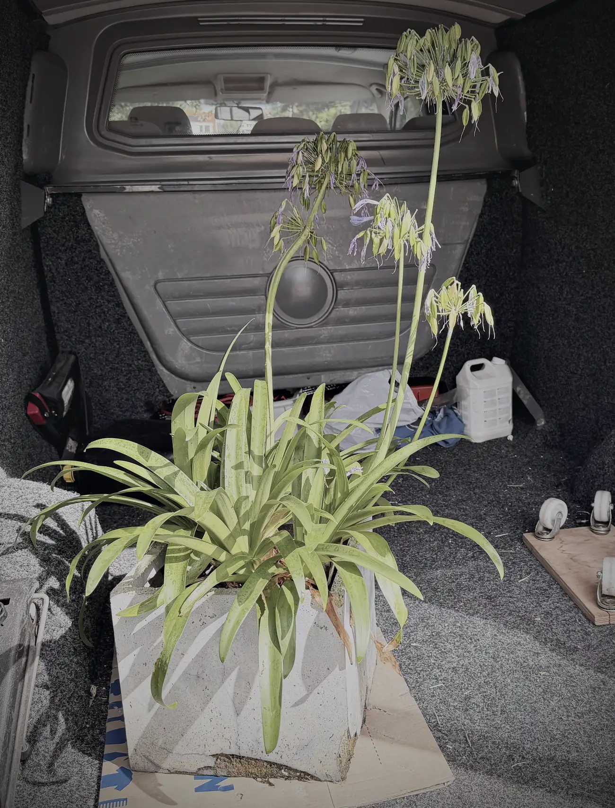
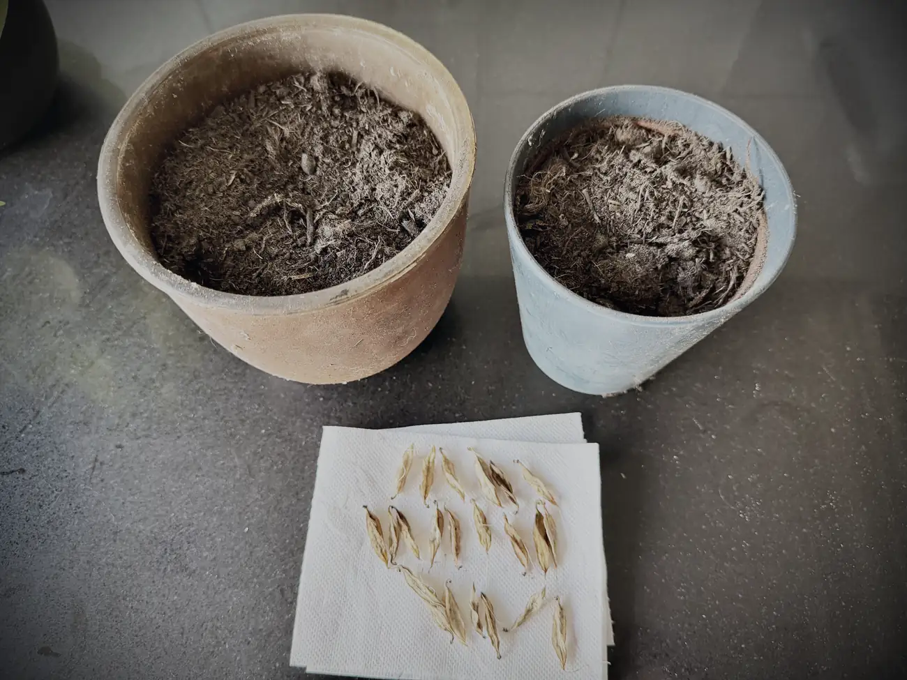
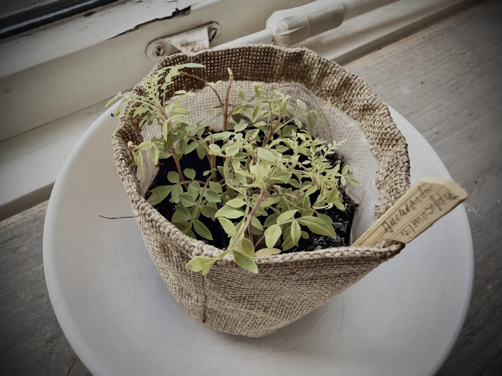
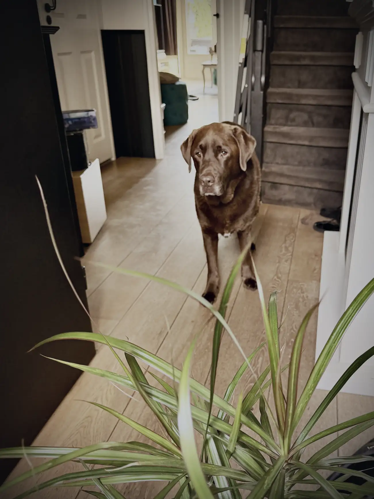

Nou ja, weg. Ze zijn verhuisd naar Nel. En waarom vertel ik zo.

De afgelopen dagen, weken, eigenlijk maanden al heb ik zoveel weggegooid, weggegeven en verkocht dat ik het bijna lekker begin te vinden. Rust in huis is rust in je koppie. Maar vandaag had ik er voor het eerst moeite mee.

Ik ben niet erg materialistisch, maar om planten en dieren geef ik wel. Wie mij een beetje kent weet dat ik een plantentik heb. Dat ik ertegen praat en de rest van de details bespaar ik je, maar het leeft. En wat je aandacht geeft, groeit.

De plant die het meeste zeer doet is de agapanthus. Die heb ik vanmiddag ingeladen en staat nu bij Nel om daar verder te groeien.

Deze plant heb ik al zo'n vijftien jaar en hij heeft een bijzondere geschiedenis. Ik werkte destijds als glazenwasser bij Paleis Noordeinde, en naast het gebouw ernaast stond een hele bijzondere woning. Daar woonde meneer Barda. Ik waste bij hem de ramen en werd altijd getrakteerd op een heerlijke cappuccino met wat lekkers erbij.

Hij hield van kunst en van planten. Zijn tuin stond helemaal vol en zijn huis hing vol met bijzondere kunst. Een aparte, intelligente man met een goed hart.

Ik vroeg hem ooit: wat zijn dit voor stekjes, meneer? Dat wordt een agapanthus, zei hij, die hebben we zelf uit het buitenland gehaald. En of ik er eentje wilde. Over dat antwoord twijfelde ik geen seconde, al had ik geen idee wat het zou worden.

Jarenlang heeft dat stekje in een pot bij mijn ouders in de voortuin gestaan, omdat ik zelf nog geen tuin had. Uitgelachen werd ik. Hahaha, jij met je onkruidplant, dat gaat het nooit worden. Vooral mijn oude buurman zag mij voor gek aan. Maar ik bleef hem verzorgen en aandacht geven. De aanhouder wint.

Jaren later, toen ik al even in Monster woonde en de plant zijn eerste bloei kreeg, heb ik die bal even teruggekaatst. Inmiddels is het een joekel.

Meeverhuizen naar Spanje had gekund, maar ik heb heel beperkt ruimte. Wat ik wel heb gedaan: een paar stekjes gemaakt. Die gaan mee, in de hoop dat ik dat project voor elkaar krijg.

Ook van mijn pannenkoekplanten heb ik tijdelijk afscheid genomen. Jeetje, wat heb ik die dingen gestekt en weggegeven. Er zijn nog aardig wat oud-studenten van de hypno-opleiding die er eentje hebben staan. Heerlijk vond ik dat, stekken en weggeven.

Mijn jacaranda mimosifolia bonsai-stekjes heb ik ook bij Nel gelaten. Die zijn nu zo'n vier maanden oud. Ik zou ze mee kunnen nemen, maar ze zijn nog kwetsbaar en bij Nel zijn ze in goede handen. Slaagt dat project, dan neem ik zeker een stekje mee als ik weer in Nederland ben.

Al mijn planten naar Nel dus. Mijn bonusmoeder, zeg ik altijd.

Een paar jaar geleden werd ik via een kennis naar haar doorverwezen. Mo had wat mankementjes en ik ben nooit zo van de medicatie, ik zoek altijd eerst naar alternatieven. Ik ging bij Nel druppels halen voor Mo en werd gevraagd om even binnen te komen. Ze zaten in de tuin: Nel, Joost, die nu mijn beste maat is, en haar dochter.

Ken je dat gevoel dat je ergens binnenkomt en je meteen op je gemak voelt? Ik heb dat niet snel. Ik ben introvert en bij onbekenden ben ik zo weer weg. Maar dit was anders. We raakten aan de praat, dronken wat in de tuin, en sindsdien is het langzaam gegroeid naar een bonusmoeder. Wij hebben elkaar in een vorig leven al ontmoet, daar waren we allebei meteen van overtuigd.

Had ik kwaaltjes, of Mo, dan ging ik naar Nel. Nel die fixt het wel. Plantenremedies, geen rotzooi, gewoon middelen uit de natuur. Daarom vertrouw ik haar mijn planten voor duizend procent toe. Zij weet hoe het leven werkt en staat net als ik in verbinding met planten en dieren.

Sommige dingen gebeuren met een reden. Soms komen er mensen op je pad die nooit meer verdwijnen. Dit is daar een voorbeeld van. Ik ga je missen, moeders. Dikke kus, en ook wij zien elkaar weer. In Spanje of in Nederland.

Ik was trouwens niet de enige die er moeite mee had. Mo was onrustig, en dat is voor het eerst sinds heel operatie De Spaanse Droom. Hij is soms lomp, maar hij voelt wel degelijk dingen aan. Wat doet baasje nou? Planten de deur uit? Dat is niet best. Alsof ze gek zijn.

Misschien een verborgen les voor vandaag. Wat je aandacht geeft, groeit. Geef aandacht aan je geliefden, maar zeker ook aan dieren en planten. Alles is energie en alles staat in verbinding.

Denk jij daar ook zo over? Laat het weten in een reactie hieronder. Ik geniet van alle berichten en heel erg bedankt voor het lezen. Dat motiveert me.
