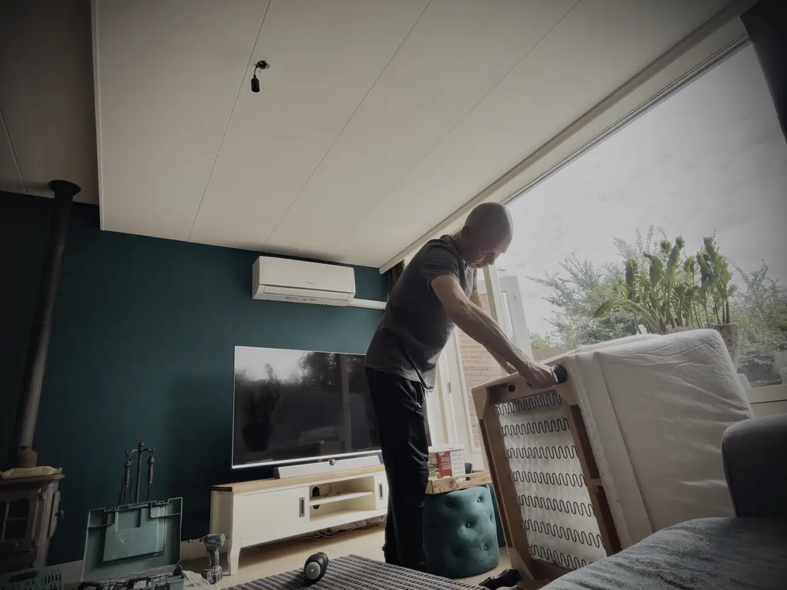
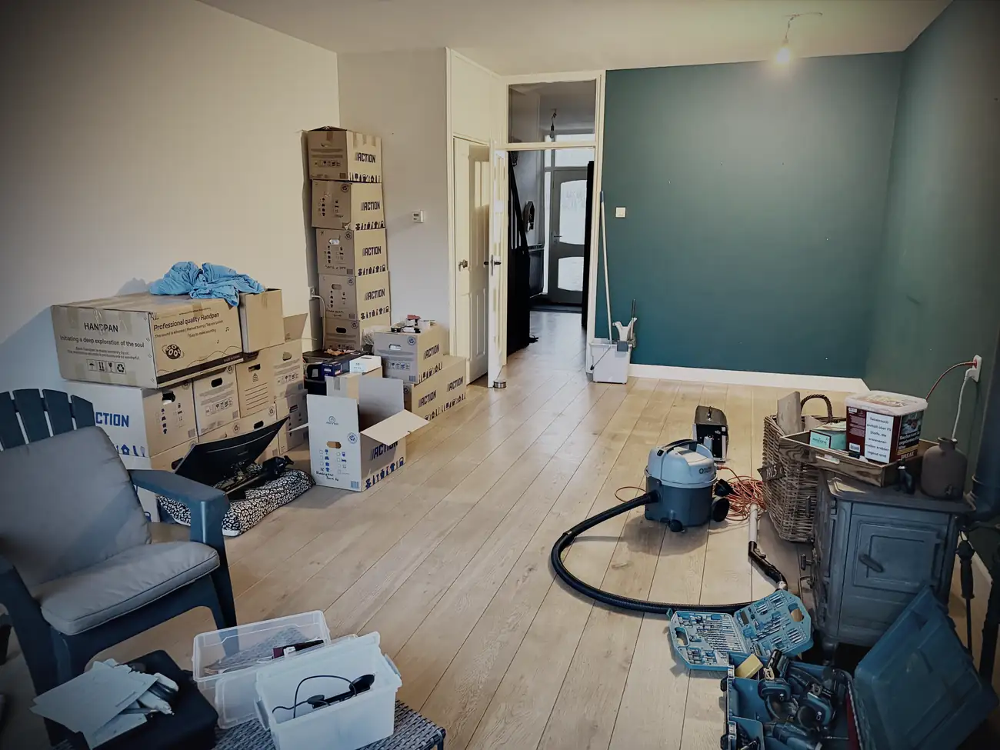
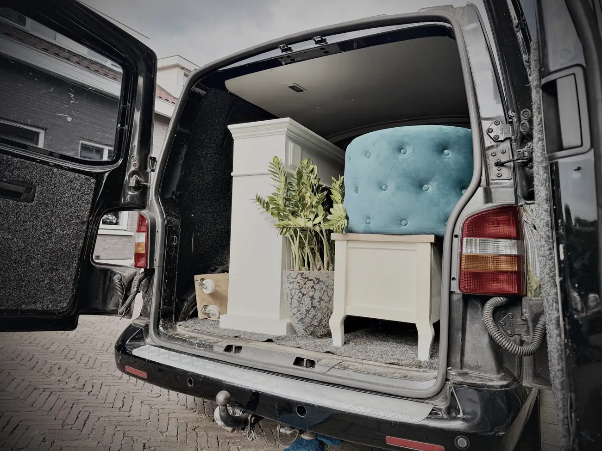
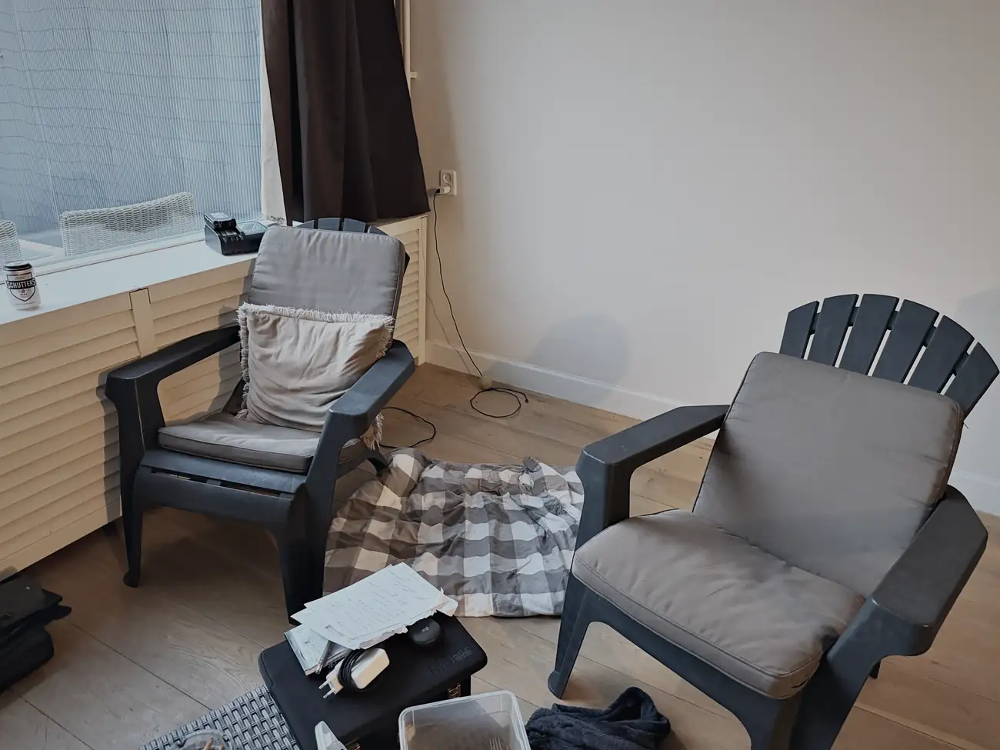

Vanmorgen was een beetje gek opstaan.

Ik had met Shir afgesproken om naar het grofvuil te rijden, zodat het zaterdag wat minder werk is als ik naar Brabant vertrek. Voordat ze kwam was ik al begonnen met het demonteren van de banken en de tafels. Tegen de tijd dat ze aankwam stonden de zweetdruppels op mijn voorhoofd.

Gaat alles oké, Wes? Ja, ik ben oké. Heb je het benauwd? Nee Shir, ik zweet me de tandjes en ik heb geen conditie.

Dat merk ik de laatste weken wel. Het sporten heb ik laten verwateren de afgelopen maanden vanwege mijn pa. Slecht excuus natuurlijk, ik zag het gewoon even niet zitten. Ik hoop dat ik dat in Spanje weer een beetje kan oppakken.

Samen hebben we de banken en de tafels naar het grofvuil gebracht. Na bijna tien jaar waren ze wel behoorlijk op. Mo vond er niks aan, die werd met de minuut zenuwachtiger. Gelukkig hadden we goed weer en rond een uur of één waren we klaar met de eerste ronde.

Even snel een boodschap gedaan, en daarna de bus weer gevuld. Nu met spullen die naar Shir gaan. Die pokkezware schouw was het ergste. Mijn tv-meubel en de poefjes gingen ook mee, plus wat klein spul.

Toen we rond drie uur naar haar huis reden, besefte ik weer wat ik vooral niet ga missen. Wat een drukte altijd, hier in die stad. Mensen overspannen, alles gehaast. Dat is een van de redenen waarom ik vertrek. Ik ben het echt zat.

Bij Shir alles uitgeladen en geïnstalleerd. Best gek om je eigen spullen ergens anders te zien staan, maar ik ben blij dat ik er iemand anders gelukkig mee kan maken. Misschien denkt ze zo nog wel eens aan die gek uit Monster.

En toen nog één keer El Mamma. Vroegah, en zeker de laatste jaren als ik bij mijn vader was, bestelde ik daar altijd. Een Egyptisch restaurant, zo ontzettend lekker. Bij Shir in de regio bezorgen ze wel, dus dat was mijn kans. Nog één keer dat broodje kipfilet met knoflooksaus. Dat soort dingen ga ik wel missen.

Ik ben Shir heel dankbaar voor de hulp. We hebben echt meters gemaakt vandaag. Al had ik er wel moeite mee om afscheid te nemen. Is dat dan de laatste keer? Ik geloof er niks van. Of ik wil het niet geloven.

Nu zit ik thuis en het is schemerig. Mijn woonkamer lijkt wel een campingplek. Wat tuinstoelen, verhuisdozen en gereedschap. De tv op de grond.

Het is goed zo.

Morgen nog het een en ander schoonmaken en nog meer weggooien, en 's avonds gezellig naar Ed en Chantal in Zoetermeer. Dan rest me nog een nachtje, en dan is het zaterdag klaar.

Geen nachtjes meer in Monster. Gek idee, maar het is goed.
