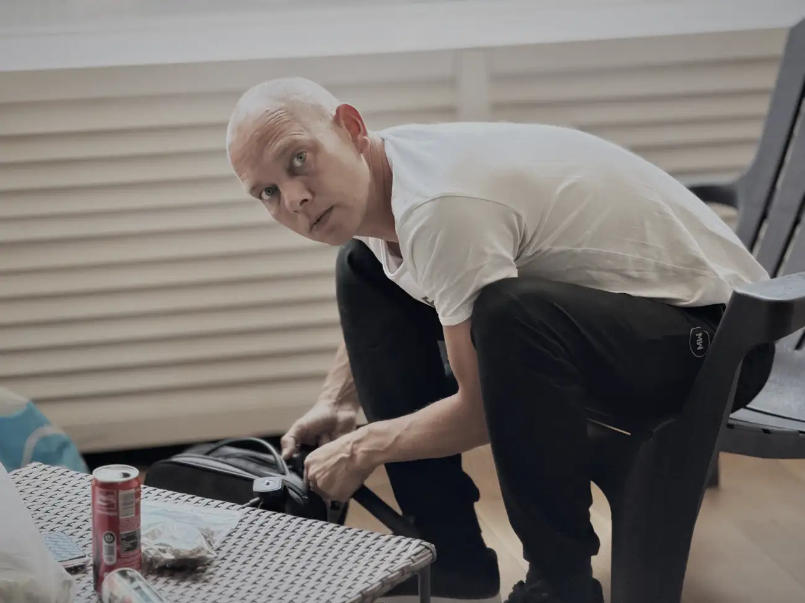
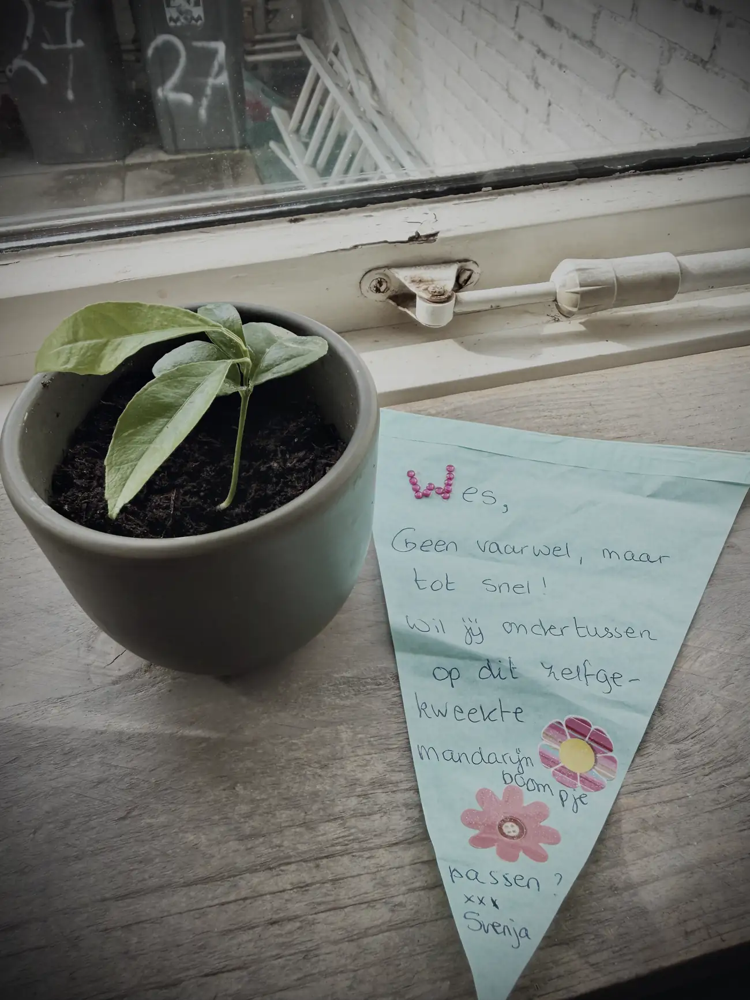
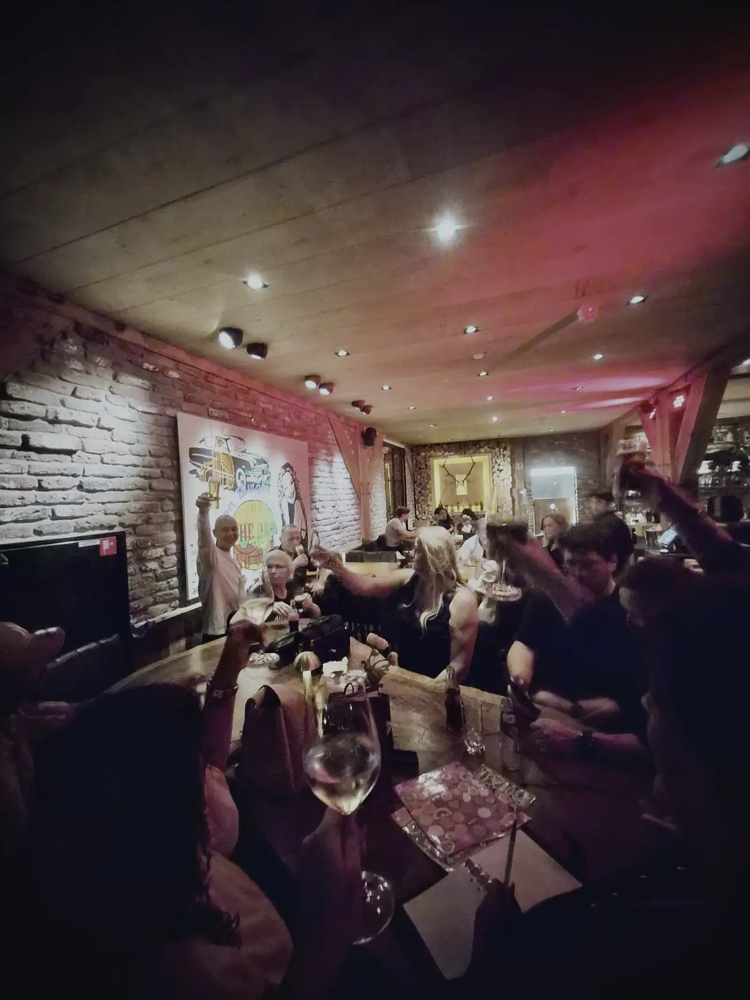
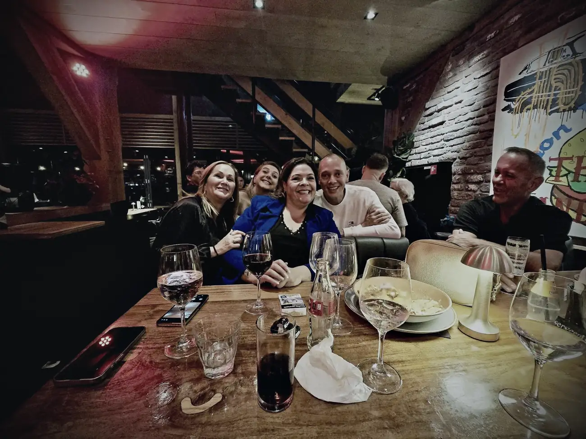
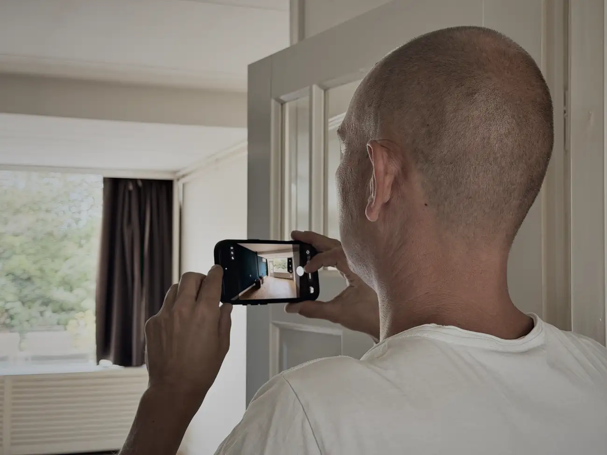
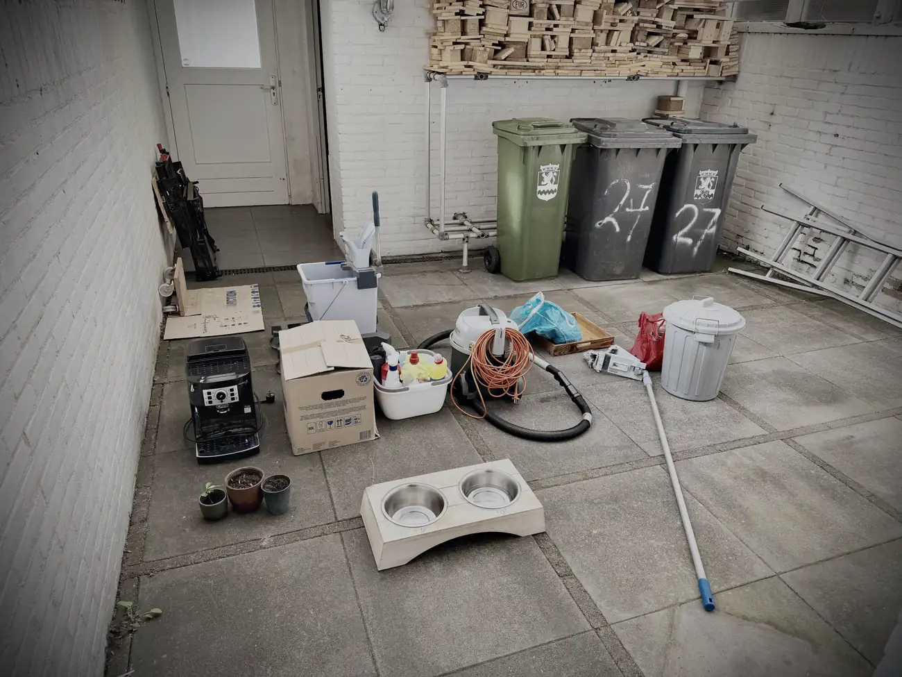
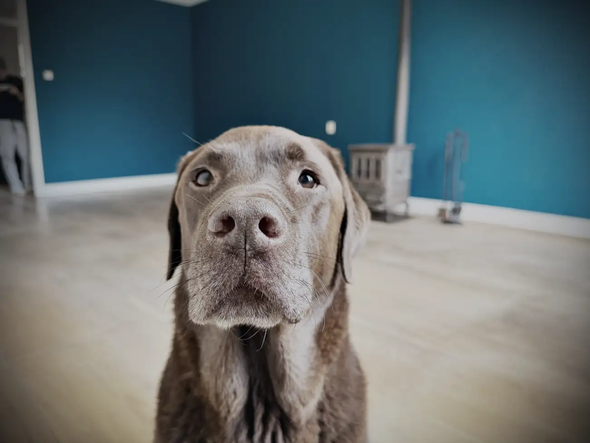

Het is zover. Ik ben eruit. Mijn laatste nacht in Monster zit erop.

Dat waren nog wel even twee dagen zweten. Gisteren vroeg begonnen met de laatste spullen inpakken, schoonmaken en voorbereiden. Ik moest meters maken, want 's avonds zou ik een hapje mee eten bij Ed en Chantal. Eerder die week zag ik dat eigenlijk niet zitten omdat ik nog zoveel te doen had, maar ze stonden erop dat ik zou komen. Nou, oké. Het is mijn laatste avond hier, en aangezien ik thuis al dagen aan het kamperen was: voilà.

In de middag kwam Svenja nog even langs, een goede vriendin met een speciaal plekje in mijn hart. Wij kennen elkaar van de hypno-opleiding en hebben sindsdien nog steeds contact. Kan ik je nog even een knuffel komen geven? Tuurlijk meis. Graag zelfs.

Ze kwam aan met een superlief mandarijnstekje. Hoe leuk is dat? Net afscheid genomen van mijn oude kinderen en nu al een nieuw baby'tje, dat het in Spanje zeker goed gaat doen. Ik beloof je dat ik er supergoed voor ga zorgen, Sven.

We hebben even lekker zitten babbelen en daarna moest ik snel door met schoonmaken, want rond zes uur zou Chantal me komen halen.

Voordat we naar Zoetermeer reden, zijn we nog even langs Het Zamen gegaan. Het verzorgingstehuis waar mijn vader bijna twee jaar heeft gezeten. Ik was daar al weken niet geweest, maar ik voelde dat ik nog één keer moest gaan. Die voelde pittig.

Nog even gesproken met wat meiden van de afdeling, en dat raakte me. Ik heb daar de laatste maanden voor het overlijden van mijn vader zoveel meegemaakt, en dit was echt de laatste keer. Met een brok in mijn keel en een traan op mijn wang stapten we de auto in.

In Zoetermeer hebben we een hapje gegeten, en toen moesten we nog ergens heen. Daar kreeg ik het enigszins op mijn zenuwen van. We gingen naar een tentje vlakbij hun huis, en toen we aan kwamen rijden zag ik een hoop mensen staan. Nee toch? Ik was moe en vroeg me af of ik dit wel ging trekken.

Eenmaal binnen schrok ik me helemaal de tandjes. Ze hadden een afscheidsfeestje voor me geregeld.

Toen ik iedereen zag was ik even goed van slag. In één blik zoveel mensen die belangrijk voor mij zijn. We hebben daar twee uur heerlijk geborreld, maar aan alles komt een eind en daar ben ik niet zo goed in. Al die mensen nog één keer bij elkaar. Dat gaat niet meer voorkomen, ben ik bang, en dat hakte er even in. Emotioneel, zwaar, maar ook zo mooi om iedereen nog even samen te hebben voordat ik ga.

Na een gezellige avond en de nodige drankjes heeft mijn zusje me thuis afgezet. Dev kwam nog even naar binnen en we zijn samen door het huis gelopen. Gek hè Dev, zo'n leeg huis? De ziel is eruit.

Het is tijd om te gaan. Nog één nachtje en dan is het klaar.

Maar dat werd vandaag nog even spannend. Echt fris en fruitig stond ik niet op, maar ik moest aan de slag. Rond twaalven was mijn broertje er om te helpen en hebben we de bus gevuld voor nog één ritje naar de vuilstort.

Ron kwam mijn tv halen. Die paste op de centimeter net in zijn wagen, en hangt nu veilig bij zijn dochter. Achteraf had dat ding nooit in mijn bus gepast.

Daarna met Jeff naar de stort en de laatste dingen weggegooid. We hebben daar nog even ouderwets Westlands gesproken met de gasten van de werf. Moahhhh, hoe is ut? Ja, bestt. Heel eerlijk: die Westlandse taal ga ik nie missen.

Snel een broodje gegeten en toen begonnen met inladen. We hebben daar een partij tetris gespeeld met dozen dat wil je niet weten. Met momenten zag ik het somber in, maar mijn broertje bleef positief en vraag me niet hoe, maar alles zit erin.

<a class="deel-knop mono" href="https://www.tiktok.com/@wesleyvaders/video/7684680506822200598" target="_blank" rel="noopener">Zie hoe we de bus vol kregen</a>

De laatste spullen in de voortuin, nog een rondje gelopen om te kijken of we niks vergeten waren, en rond vier uur was het klaar.

Mo werd met het uur zenuwachtiger, en dat is niet gek. Acht jaar woont hij hier al en nu is alles leeg. Ik heb nog even wat foto's gemaakt, en daarna was het deur op slot en richting Hoeven. Daar slaap ik de komende dagen.

Op 17 september moet ik nog één keer terug voor de eindinspectie, en dan naar de notaris. Dan sluit ik een hoofdstuk af.

Klaar voor een nieuw avontuur. Dat ga ik de komende tijd met jullie delen. En ik wil iedereen bedanken voor alle lieve berichten, de hulp, en het onderdeel zijn van mijn leven.

Eén ding weet ik zeker: mijn voetjes zijn er klaar mee.
