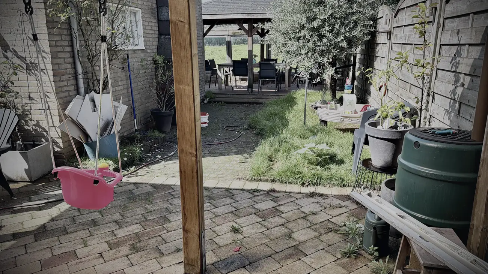
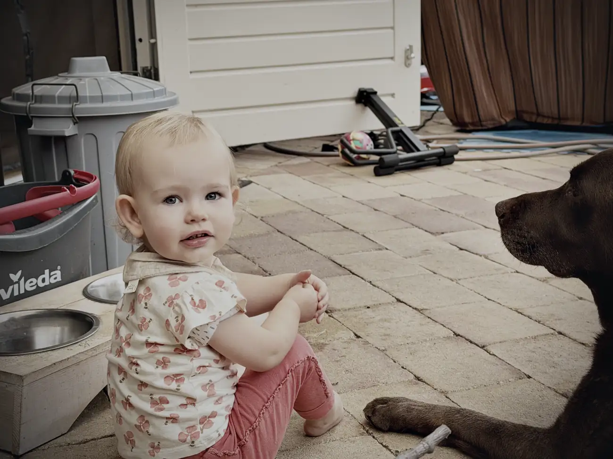

Vanavond wordt mijn derde nacht in Brabant. De eerste was een nachtmerrie, of zes.

Ik slaap altijd het liefst thuis, maar mijn oude huis is geen thuis meer. Dat huis is leeg. No way back.

Zaterdag zijn we naar Brabant gereden. Bus helemaal vol met al mijn hebben en houden, en Jeffs wagen ook nog eens volgeladen.

Ik had de bus laatst helemaal na laten kijken voor de reis naar Spanje. Voor de veiligheid, maar ook omdat ik opeens vermogen verloor en niet harder kon dan negentig, honderd op de snelweg.

Het probleem bleek de roetfilter. Daar zat een gat in en hij was helemaal zwart. Ik heb hem gezien, en dat verklaarde waarom ik van honderddertig terugviel naar honderd en geen vermogen meer had. Na herstarten was het opgelost, maar goed is het niet.

Roetfilter vervangen, bus uitgelezen, probleem verholpen. Zou je denken.

Maar toen ik zaterdag naar Hoeven reed, viel mijn vermogen weer weg. We zijn even gestopt, motor opnieuw gestart, en ik kon weer gassen.

Daar lig ik nu wakker van.

Ik heb geen zin om straks in de bergen zonder vermogen te zitten. Ik heb op dit moment mijn hele leven in die bus staan, en die kan me nu echt niet in de steek laten. Morgen heb ik een afspraak bij een garage hier in Oudenbosch om hem te laten uitlezen. Ik hoop dat de schade meevalt.

Maar dat betekent ook dat ik niet zeker weet of ik de twintigste echt vertrek. Is er iets met de turbo of iets anders, dan moet en zal ik dat laten maken. Dat risico ga ik niet lopen. Maar dan moet er wel plek zijn bij de garage, en afhankelijk van het probleem ben ik misschien morgen niet aan de beurt.

Ik maak me daar serieus zorgen over. Ik heb zelfs even de neiging gehad om een oude camper te kopen en alles over te gooien. Maar ik moet morgen gewoon afwachten. Lekker zit het niet. Ik wil op reis en dit geeft meer stress dan rust.

Heb je tips of gedachten, dan hoor ik ze graag. De uitslag van morgen deel ik met jullie.

Verder is het heerlijk vertoeven hier. Ik ben eigenlijk van de ene camping naar de andere verhuisd, maar wel met beter uitzicht. En ik heb mijn was weggewerkt, dus over schone kleren hoef ik me geen zorgen meer te maken. Wat dat betreft zijn we een stap verder.

Mijn broertje en schoonzus wonen hier fantastisch. Ik zit veel in de tuin, met uitzicht op het veld van de lokale boer dat momenteel vol staat met afrikaantjes.

Ik geniet van Brabant. De mensen zijn chiller dan in de randstad, je haalt je eten bij de boer en er ligt een prachtig bos op loopafstand. Ik hoop daar nog even van te genieten in plaats van me zorgen te maken over de bus.

Fijn is ook om Lola, de hond van mijn broertje en schoonzus, met Mo te zien stoeien. Dat zijn maatjes voor het leven. Mo is nogal lomp en impulsief, dus ik maak me weleens zorgen of dat goed gaat met mijn nichtje Sara, maar dat gaat prima.

Ik ben heel blij dat ik hier kan bivakkeren. Maar dat busje zit me dwars.

Sommige dingen heb je niet in de hand en moet je uit handen geven. Misschien blijf ik hier iets langer en kan ik de twintigste niet rijden. Dan moet het zo zijn.

Alles gebeurt met een reden. Alles komt goed.
