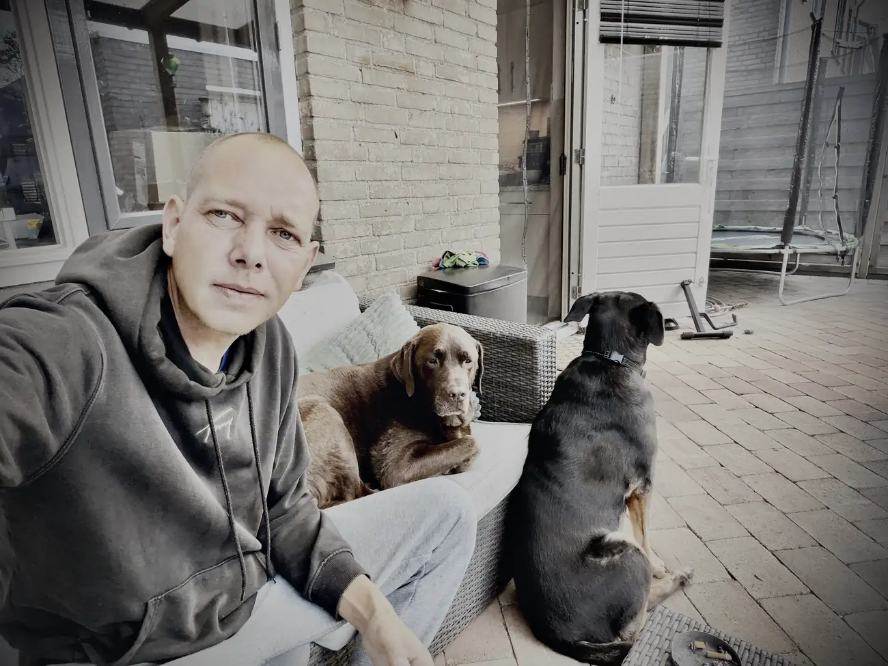
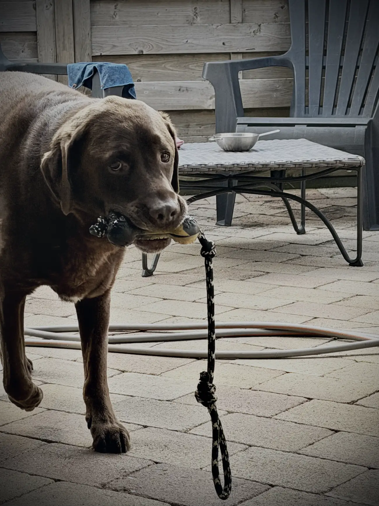

Morgen is het zover. Een laatste ritje naar het Westland om te tekenen bij de notaris.

Gisteren heb ik mijn bus bij een vakgarage achtergelaten. Ze hebben hem uitgelezen en het blijkt drukverlies bij de turbo. Er zit ook zwarte roet rondom de turbo.

De monteur zou alle slangen en koppelstukken nakijken. Vandaag rond één uur kreeg ik een telefoontje dat de bus klaar was, voor zover mogelijk. Er is een drukomvormer vervangen en een omschakelklep.

Ik weet nog net hoe ik olie bijvul en mijn banden oppomp, maar van dit soort zooi heb ik geen verstand. Voor nu was dit alles wat ze voor me konden doen, met het oog op mijn vertrek zondag.

Ze hebben nog een testrondje gereden en er is geen foutmelding meer. Maar de monteur heeft zelf ook een T5 en gaf aan dat hij echt nog wel vermogen miste. Voor mij rijdt de bus vrij normaal, dus misschien speelt dat al langer. En hij ligt helemaal afgeladen, dat gewicht werkt ook niet mee.

Kan ik zo naar Spanje rijden, vroeg ik. Ja, dat kan. Rustig aan, en in Spanje eventueel de turbo laten vervangen. Zou ik dat in Nederland willen doen, dan ben ik weken verder en die tijd heb ik niet.

Ik heb nog heel even getwijfeld om iets anders te kopen, maar dat is te veel gedoe in te korte tijd.

Volgens de monteur kan ik dus gewoon gaan. Maar dit hele gebeuren heeft me wel aan het denken gezet.

Daarom stel ik mijn roadtrip uit.

Ik rij wel naar Spanje, maar via de normale route. Geen onnodige 750 kilometer. Eenmaal leeg in Spanje durf ik het wel aan, maar ik merk dat ik er stress van krijg om met al mijn persoonlijke spullen die gok te wagen.

Verandering van plan dus. Ik ga wel, maar in één rechte lijn.

Aan de ene kant baal ik ervan. Aan de andere kant denk ik dat het me rust geeft. Nu heb ik twee of drie dagen het idee dat de bus me in de steek kan laten. Dat is beter dan acht of negen.

En dan zien we in Spanje wel verder.

Morgen is het de grote dag. Wat vliegen die dagen voorbij. Mo heeft het hier prima naar zijn zin samen met zijn vriendin Lola, maar ik geloof dat we er allebei wel klaar voor zijn.

Nog een paar nachtjes in Brabant en dan is het zover. Vamos.

En als klap op de vuurpijl heb ik gisteren nog een stukje kies afgebroken. Of een vulling, geen idee. Gisteren nergens last van, vandaag kan ik moeilijk eten en doet koud drinken pijn. Kan er ook nog wel bij.

Ik ben twee weken geleden nog bij de tandarts geweest en toen was er niets aan het handje. Aan het tandje, bedoel ik. Nou ja, ze zullen in Spanje ook wel tandartsen hebben. Maar waarom gebeuren dit soort dingen altijd precies als het niet uitkomt?

Wat denk jij? Verstandige keuze, of heb je zoiets van: doe niet zo moeilijk. Ik hoor het graag.
