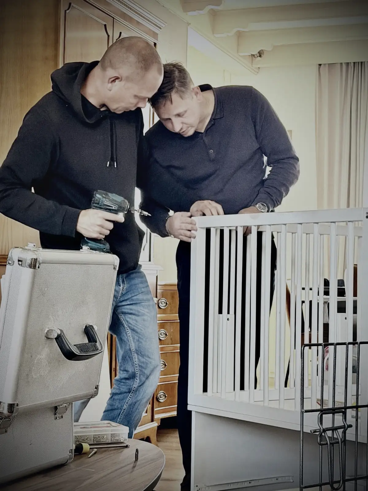
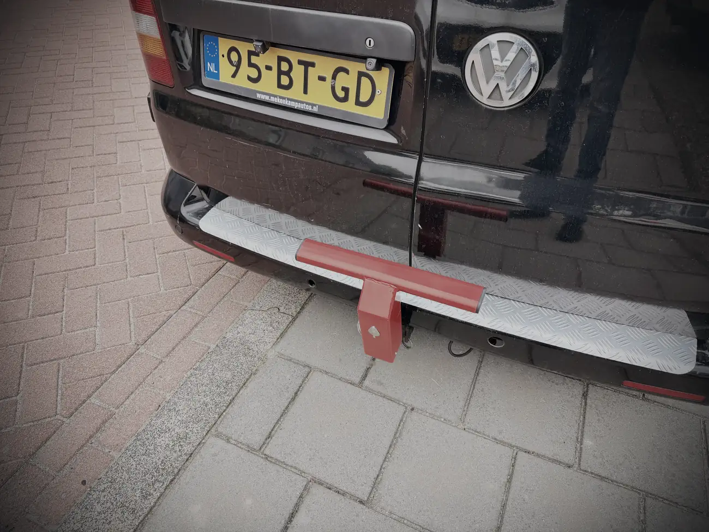
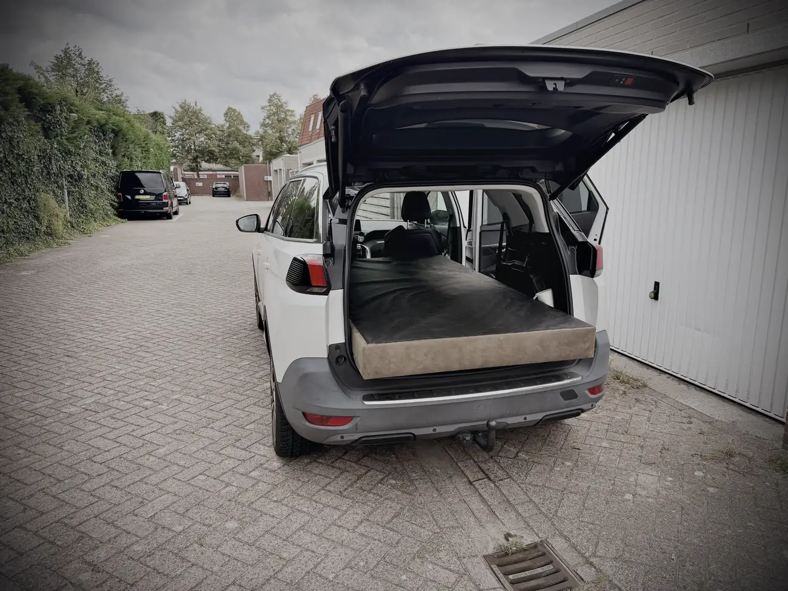

Morgen is het zover. Eindelijk. Viva España.

Ik kijk er serieus naar uit om een paar dagen in de auto te zitten. Ik heb me de tandjes gewerkt hier in Hoeven, maar met liefde. We hebben zoveel gedaan deze week. Waar mijn schoonzus aan het begin van de week door de bomen het bos niet meer zag, is er nu overzicht en licht aan het eind van de tunnel.

Gisteren hebben we meubels omgegooid, bedden uit elkaar gehaald, de babykamer klaargemaakt en een box in elkaar geschroefd.

Volgende maand verwacht ik een nieuw wondertje. Een neefje of een nichtje, Joost mag het weten. Sorry maat.

Blij dat ik daar nog mee heb kunnen helpen. Het betekent ook dat ik volgende maand waarschijnlijk alweer in Nederland ben om dat wondertje te bewonderen. In de hoop dat de bus dat allemaal overleeft. Maar daar heb ik wel vertrouwen in.

Gisteren en vandaag nog wat kilometers gemaakt. De bus rijdt prima, maar vermogen mis ik wel. Even snel inhalen of hard optrekken zit er niet in. Dan maar wat meer tranquilo. Kan ik alvast wennen aan de Spaanse mentaliteit. Het komt goed.

Gisteravond hebben we een gezellig avondje gehad met het broertje en zusje van mijn schoonzus, en aanhang. We hebben het uitgebreid over mijn plannen gehad, en over mijn zorgen. De bus natuurlijk, maar ook de spullen die achterin liggen en het risico op inbraak. Daar zit je niet op te wachten.

Toen kwam Eric met het geniale plan om een slot op de trekhaak te zetten. Waarom heb ik daar zelf niet eerder aan gedacht?

Gisteravond ben ik onder het genot van een sigaar samen met Jeff en Bas gaan zoeken, en we kwamen er eentje tegen op Marktplaats in Etten-Leur. Die hebben we vanochtend opgehaald. Weer een beer van de weg gemept.

Daarna zijn we op mijn voorlopig laatste dag in Nederland bedden gaan verhuizen, monteren en verplaatsen. Lekker, zo op je laatste dag. Met een loopneus van hier tot Tokio hebben we tot laat in de middag lopen sjouwen met beddenspullen. Ik ben dan ook blij als ik straks mijn eigen bed zie.

Vanavond de bus nog in orde gemaakt en alvast het een en ander ingepakt. En dan is het morgen zover. Dan gaat de reis beginnen. Ik wil morgen in elk geval Dijon voorbij komen en dan ergens vóór Lyon stoppen. Daar rust pakken en de volgende dag verder kachelen. Ik hoop dinsdagmiddag in Alfaz del Pi aan te komen.

Niet zoals gepland. De roadtrip is vervangen door een reis van twee, drie dagen.

Ik ga proberen onderweg mooie beelden te maken en die op de socials te zetten. Het wordt helaas niet de reis die ik voor ogen had, maar ik wil vooral veilig aankomen. Als de bus daar of later in Nederland gemaakt is, maak ik die roadtrip alsnog. Met minder spullen en minder stress.

Voor nu: hasta mañana. Het gaat nu echt beginnen.

Vergeet niet een berichtje achter te laten in mijn gastenboek of onder dit verhaal. Ik lees alles en geniet ervan.
