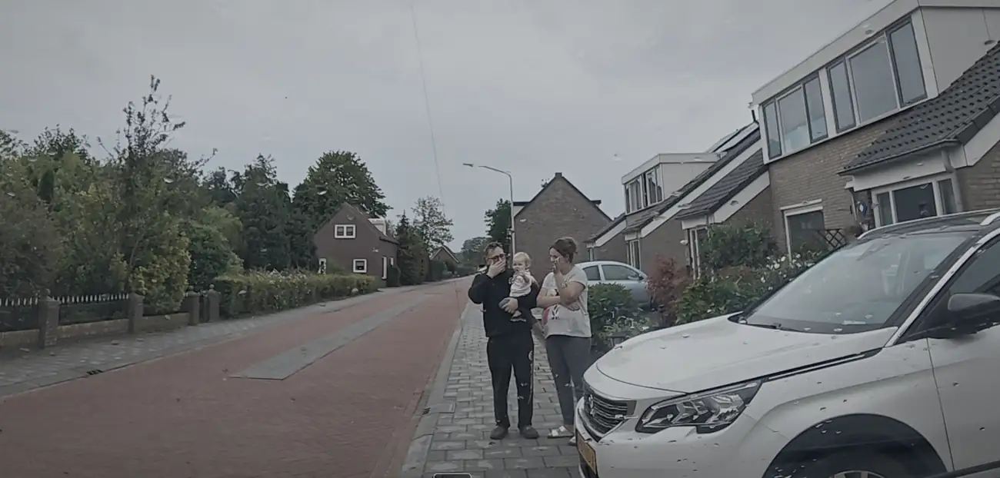
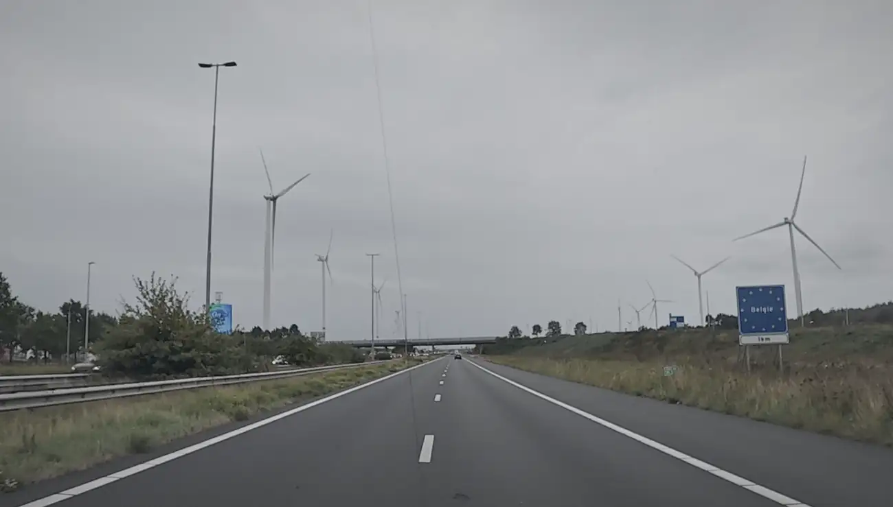
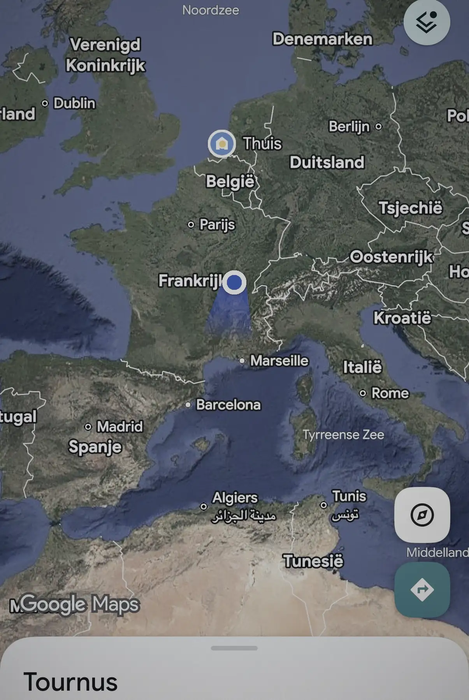
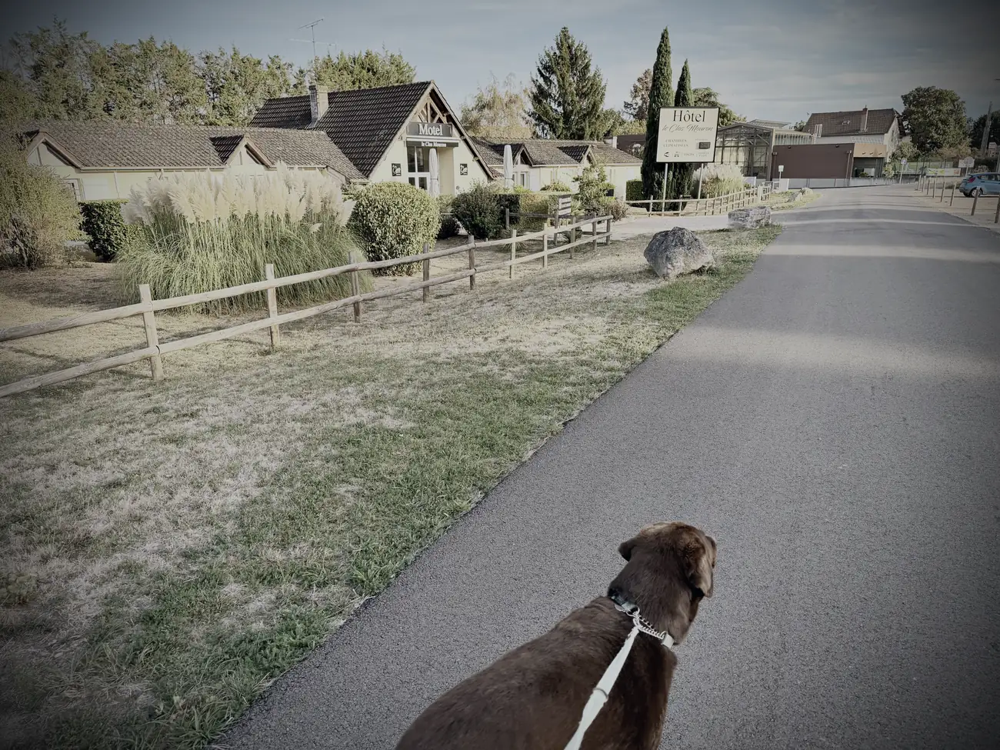
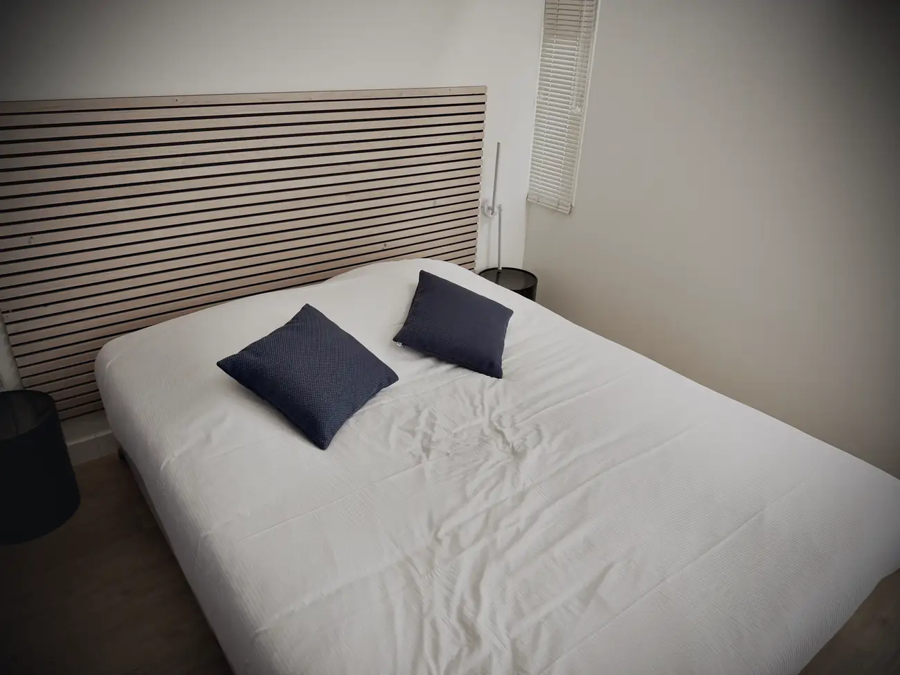

Gisteravond op tijd het bedje in en bijzonder goed geslapen. Rustig ontbeten met Jeff, Anouk en Sara, de hondjes nog even uitgelaten, en rond tien uur was het tijd.

Busje vol, mijn tijdelijke huis uitgezwaaid, en met enige zorg de weg op.

Via Antwerpen, langs Brussel, richting de Franse grens. Wat een bagger weer onderweg. En toen een stuk door de Ardennen, waar de echte test begon.

Invoegen zonder vermogen is een drama. Korte invoegstroken, jij met tachtig en de rest met honderddertig. Niet heel fijn. Maar eenmaal rollend gaat het wel.

Op een gegeven moment maakte ik er een spelletje van: zo hard mogelijk de berg af om genoeg vaart te hebben voor de volgende berg op.

Daardoor kwam ik steeds dezelfde auto's tegen. Bergaf haalde ik ze in als een jekko, bergop haalden zij mij weer in. Die zullen wel gedacht hebben: ik weet niet wat die Nederlander achterin heeft liggen, maar dit is niet normaal.

De Ardennen waren pittig, maar ik kreeg er langzaam feeling in. Zodra ik ga klimmen en onder de honderdtien kom, terugschakelen naar de vijf. Onder de negentig naar de vier. Eén keer heb ik in de drie moeten klimmen.

Allemaal niet heel relaxed, maar het was te doen. En ik ben blij dat ik zo'n zevenhonderd kilometer heb afgetikt vandaag.

We hebben nu een motel gevonden in Tournus, tussen Dijon en Lyon. Nog zo'n twaalfhonderd kilometer naar Alfaz del Pi. Op papier kan ik dat morgen rijden. Als ik om acht uur vertrek ben ik er rond een uur of negen 's avonds, als het meezit.

Maar dan moet het busje het wel blijven doen. Ik ben blij met wat hij vandaag gepresteerd heeft, maar ik merk dat hij het zwaar heeft. En voor mij is het ook vermoeiend.

We zien het morgen wel. Wij gaan zo lekker het mandje in, en met een beetje geluk komen we morgen een heel eind.

Salut.
