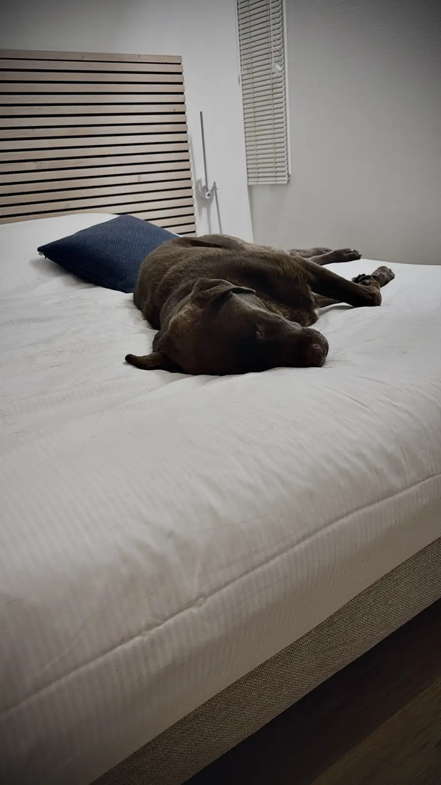
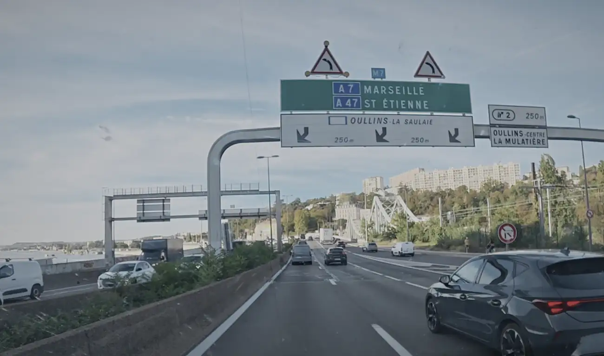
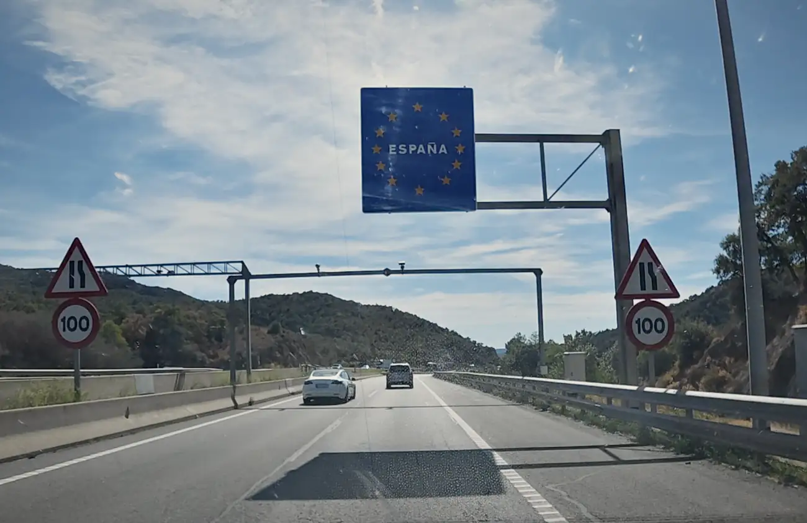
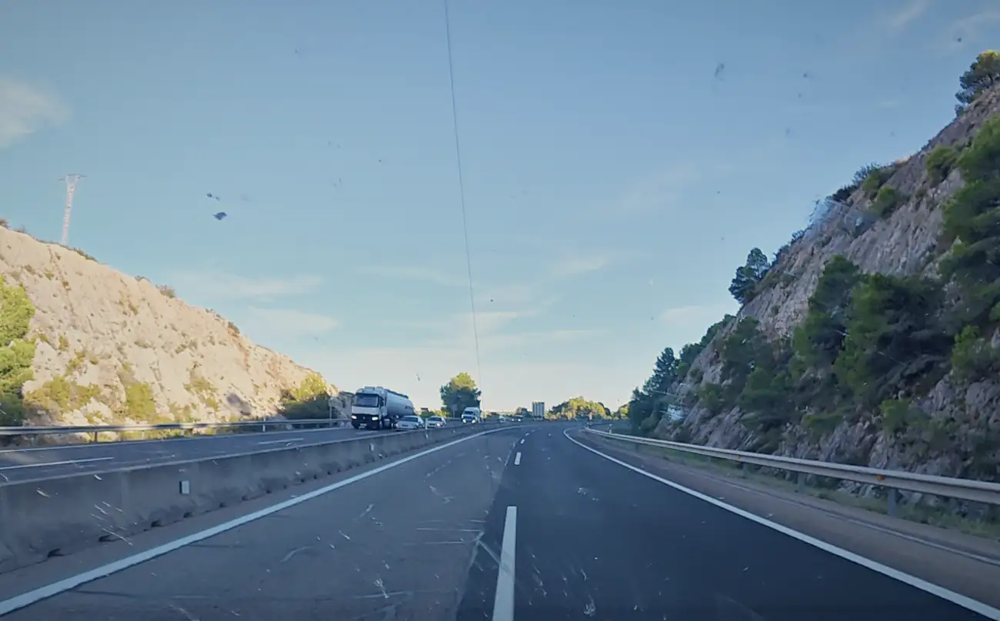
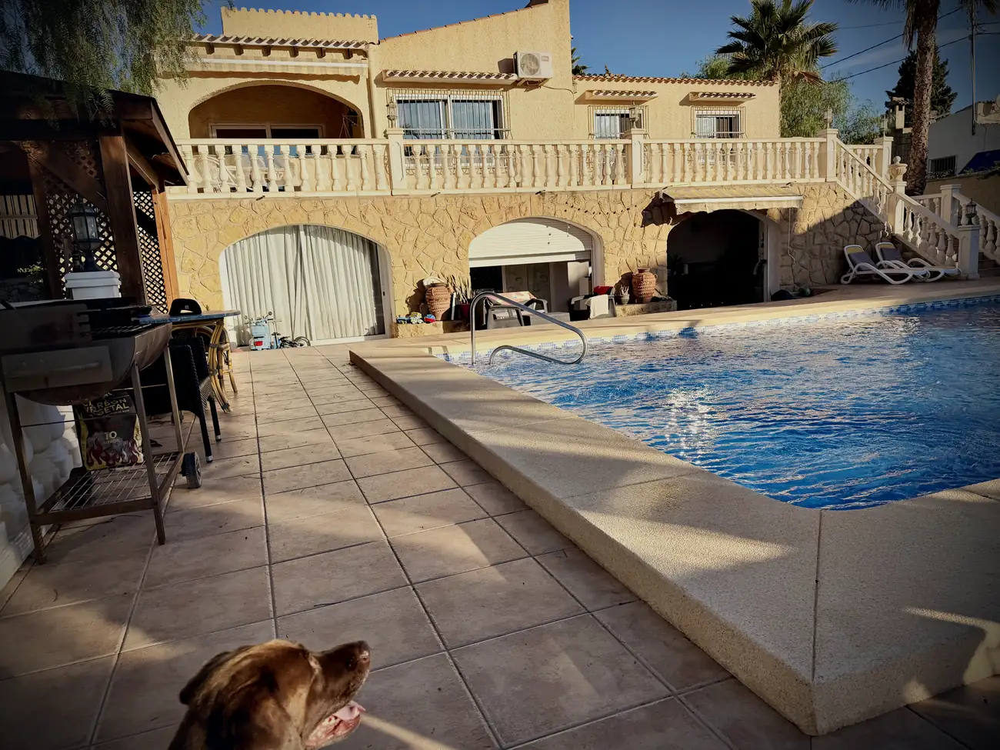

Na een prima nachtrust tussen Dijon en Lyon waren we vroeg uit de veren. Mowgli mag nooit op bed slapen, maar deze keer zag ik het even door de vingers.

Die eerste dag rijden heeft hij het zo goed gedaan. Je hoort hem niet, hij klaagt niet. Af en toe gaat hij zitten omdat hij het te warm heeft, want de airco van de bus kan die ruimte niet aan en het werd snel warm. Rond de Spaanse grens was het 35 graden.

We hadden een keuze. In 1 keer die 1250 km wegrijden, of op me gemakkie ergens halverwege blijven slapen en vandaag de reis afmaken.

Nadat we de spullen in de bus hadden gezet, zijn we om een uur of 08:00 richting Lyon vertrokken. In gedachten stelde ik me vader de vraag. Wat zou jij doen, pap? In 1 keer doorknallen met een bus die geen vermogen heeft, of rustig aan doen?

Ik zat in gedachten met hem in gesprek en ik hoorde hem zeggen: gewoon knallen met dat ding. Kan jou het verotten. Ik vind het wel een avontuur.

Je hebt gelijk, pap. We gaan ervoor. Als ik doorknal ben ik er rond 20:00, denk ik? Ga ik dat echt doen, pa?

Ja pikkie. Knallen met dat ding.

Echt lang hebben we niet kunnen communiceren.

## Lyon

Maandagochtend, rond 08:30, 09:00, reed ik Lyon in. Voor wie dat stukje A7 kent: het is een mooi stuk langs het water en dwars door de stad, maar het kan er druk zijn. Ik zat er zwaar de spits in. En in alle chaos neem ik door de zenuwen precies de verkeerde afslag, en rij ik dwars door de binnenstraten van Lyon. Overal klimmen en klauteren, precies wat ik niet kan hebben, en overal rete druk.

Pap, wat is dit, man?

Kan jou het verotten, Wes. Gewoon gassen.

En bam, ik zat weer op de A7. Door de file te vermijden had ik zelfs 10 minuten ingehaald. Een geluk bij een ongeluk. Maar dit was me eerste zweetmomentje, en toen was het nog niet eens zo warm.

## De klim

Na Lyon blijft het nog een druk stuk en daarna kruip je langzaam omhoog richting de grens. Vrij rechttoe rechtaan, soms wat klimmen en dalen, maar goed te doen.

Ik wist dat het echte werk ging beginnen na Le Boulou, de laatste afslag voor de grens. Daar had ik me laatste tol, en als je moeite hebt met op gang komen is dat geen fijne plek, want vrijwel direct begint de klim naar de Spaanse grens.

Ik wist dat hij eraan kwam. Daarvoor ben ik nog even snel gestopt met Mo, zoals we de hele reis doen. Snel een plasje, even wat drinken, en gas.

Dat het pittig ging worden wist ik ergens wel. Maar daar kwam me tweede zweetmoment. Het klimmen begon vrijwel direct na de tolpoort, terwijl ik nog snelheid aan het opbouwen was met alle vermogen dat ik had. Resultaat: ik begon aan die klim met zo'n 80 km/u in plaats van de 120, 130 km/u die ik de hele reis al reed. Hard de berg af, langzaam de berg op. Het kat-en-muisspelletje waarbij iedereen denkt: wat doet die Hollander?

Ik kreeg het er spaansbenauwd van. Tussen de vrachtwagens die om en om voorbijschieten. Soms reed ik net iets harder dan een vrachtwagen, maar inhalen kon niet, want links ging alles veel sneller en zat ook te klimmen. Ik schoot van de rechterbaan naar de linkerbaan en weer terug, gesandwicht tussen de vrachtwagens, serieus in overlevingsmodus. In z'n 4, zo'n 70, 80 km/u. Ik hoorde de motor vechten.

En na 2, 3 km angstzweet werd het vlak. Daar stonden de oude verlaten douane- en tolhuisjes, en ik wist het: we zijn er bijna.

We zijn in Spanje, Mo!

Met de wetenschap dat ik er nog lang niet was, maar dat ik wel een van de zwaarste stukken had gehad. Ik voelde een opluchting. Met nog ruim 650 km te gaan kreeg ik vertrouwen. Een soort zelfvertrouwen.

We hebben het geflikt, pa.

Ik werd er een beetje emotioneel van. De hele reis was al een rollercoaster, maar dit was een hoogtepuntje. En tegelijk wist ik: ik ben er nog niet.

## Barcelona

Ik had nog genoeg diesel om door te rijden tot net na Barcelona, en dat was me streven. Als ik doorrijd ben ik rond 15:00 voorbij Barcelona en vermijd ik de spits, was me gedachte. Daarna wordt het rustiger. Dat heb ik gedaan, met de nodige bergen, maar redelijk te doen.

Alleen knalden we in Barcelona wel de file in. Niet heel heftig, maar het voelde niet fijn. Optrekken vanuit z'n 1 en doorschakelen, en dan hoor je die motor serieus vechten. De muziek had ik uitgezet. Ik was 1 met me motor. Gelukkig viel het mee en kon ik door naar Valencia.

Daarvoor zijn we nog 1 keer wezen tanken. Zo'n 2 euro voor een liter diesel hier, in Frankrijk had ik er 2,25 voor betaald. Ten opzichte van Nederland valt het allemaal wel mee, maar na een dag Frankrijk voelde dit als winst. Doe er ook maar een pakje sigaretten bij voor de stress. Una L&M rojo, por favor. 6 euro.

Bij die stop had ik nog zo'n 400 km te gaan. Ik heb deze rit al vaak gemaakt, maar nooit alleen. Met me vader, met me broertje, me zusje. Alleen is toch wel pittig, en zeker met geen vermogen.

Maar ik voelde dat het ging lukken.

## De laatste 400

Al denk je dat 400 km niet veel is, ongeveer 4 uur, een derde van de dag, het is echt een aardig stuk. Gas erop. 130 km/u de berg af, 100 km/u de berg op. Weer dat spelletje waarbij je iedereen inhaalt en vervolgens weer door iedereen ingehaald wordt.

En als klap op de vuurpijl knal ik bij Valencia weer de file in. Die motor maakt geluiden en ik denk bij mezelf: alsjeblieft. Laat me rijden. Ook nu viel het gelukkig mee, maar die laatste loodjes zijn zwaar.

Na Valencia krijg je een vrij saai stuk. Veel radarcontroles en verder weinig spannends. Je wordt moe, en dan zie je de navigatie. Nog 350 km. Nog 300 km. Nog 250 km. Nog 200 km.

En geloof me, 200 km is veel als je er al ruim 1000 op hebt zitten, na 10 uur rijden met een bus zonder vermogen. Oké dan. Nog een korte stop en gaan.

Nog 100 km. Het is een uur of 19:00. Moe, honger, klaar met de reis. Maar ik zal en ga het halen.

En dan zie je bekende plaatsnamen. Gandia. Dénia. Calpe. Dat stuk rijden is leuk. Het klimt, maar het is bochtenwerk, en dat vind ik heerlijk. Met alle energie die ik nog overhad, levend op stroopwafels, knal ik die laatste 100 km erin. Afslag Altea eraf, en daarna is het voorbij gesneden koek.

Dit wordt me nieuwe thuis. Niet Altea, maar de omgeving. Hier voel ik me goed. Ik voel dat me ouders bij me zijn.

Dit is het, Wes. Goed gedaan, pik.

Uitgeblust kwam ik aan bij Pat en Sori. We hebben een paar cerveza's gepakt en ik ben gaan slapen.

## Vandaag

Me eerste dag wakker worden in Spanje.

Ik ben rond half 8 opgestaan, en dan gaat alles tranquilo. Mo uitlaten. Even douchen. Vechten met het koffiezetapparaat. Rond half 10 zijn we op pad gegaan. Even naar Albir, heerlijk een cappuccino gedronken en ja, sorry, een saucijzenbroodje. Om 11:00 een afspraak bij de gestor, de boekhouder, en gelijk dingen geregeld. Om 12:00 een afspraak in Benidorm. En voor je het weet is het alweer eind van de middag. Nog even, ja het spijt me, een broodje bal gegeten in Alfaz del Pi met een pint. En daarna nog 2 uurtjes wezen verven bij Pat thuis.

Ik voel me thuis hier. Alles op me gemak. Wat vandaag niet lukt, doen we morgen.

Ik ben blij dat ik nu tijdelijk verblijf in het appartement waar me ouders ook altijd zaten als ze op vakantie waren, bij de ouders van Pat. Zijn vader Jan en mijn vader waren 30 jaar lang hele goede vrienden. Ze deden alles samen. En dat ik hier nu ben, en dat we vandaag samen lekker zaten te vertoeven, voelt fijn en vertrouwd.

Zo komen zielen bij elkaar, en blijkbaar gaat dat generaties door.

Hé Pat, wie weet krijg ik ooit nog een kind en worden onze kinderen ook vrienden. Zaten we vandaag over te praten.

De toekomst zal het leren. Voor nu ben ik blij. Nieuw hoofdstuk, nieuw leven. Al is dit geen vakantie, en moet ik morgen ook gewoon weer aan het werk. Maar heel eerlijk, wakker worden is hier toch anders. De vraag of ik hier wel kan wennen is eigenlijk in 1 dag beantwoord.

De tijd zal het leren. Ik leef vanaf nu in het hier en nu. Tuurlijk zal het verleden me soms achtervolgen en zal de toekomst me zorgen baren, maar dit voelt goed.

Mocht je dit gelezen hebben: gracias. Dankjewel.

Welterusten, buenas noches. Tot morgen, hasta mañana.

Ik moet ergens beginnen.
