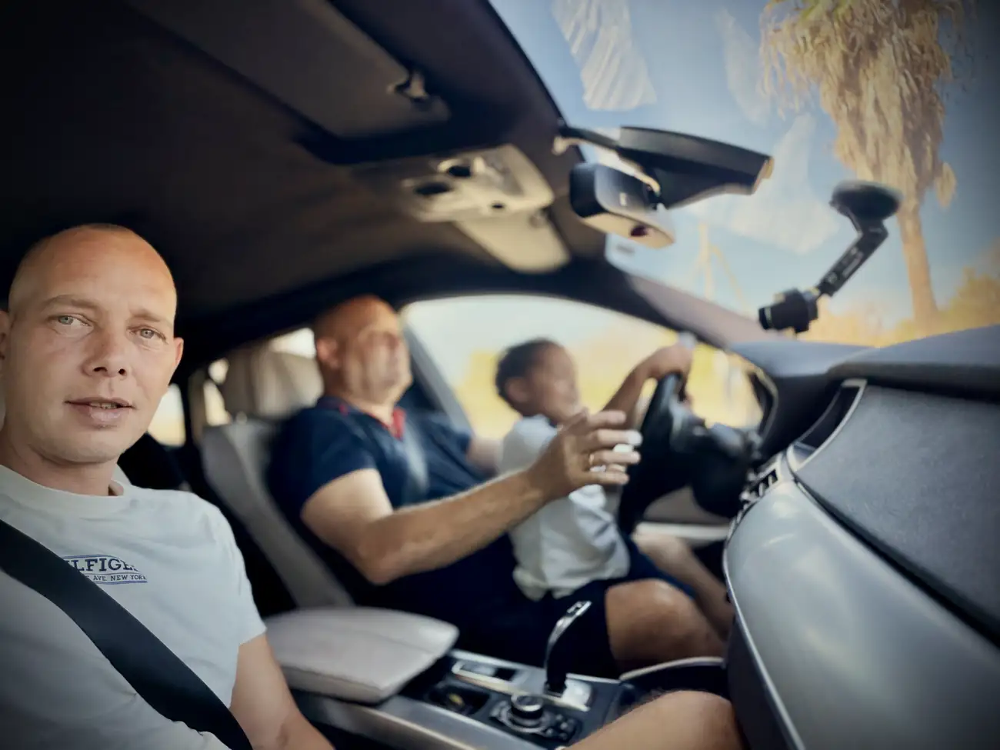
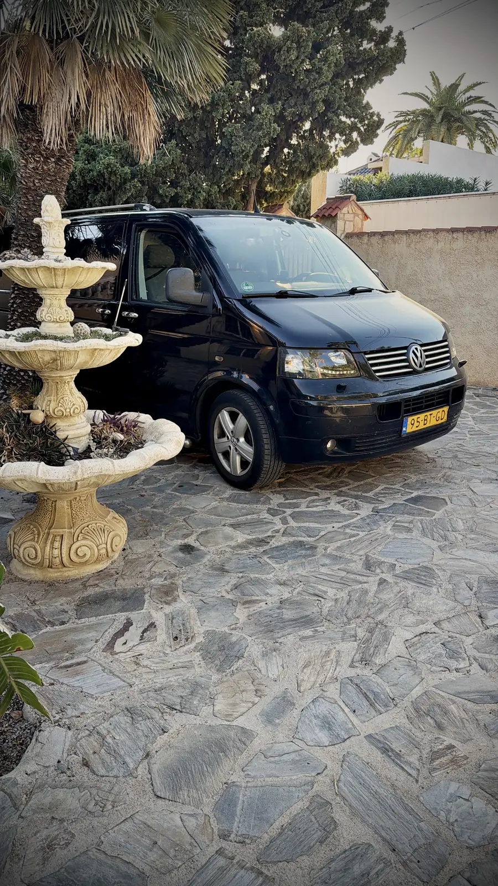
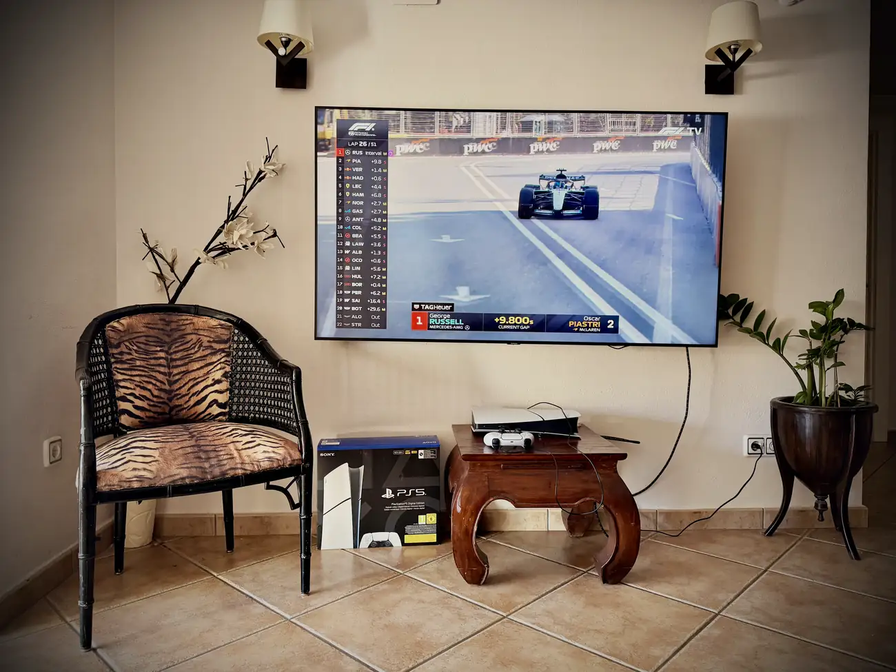
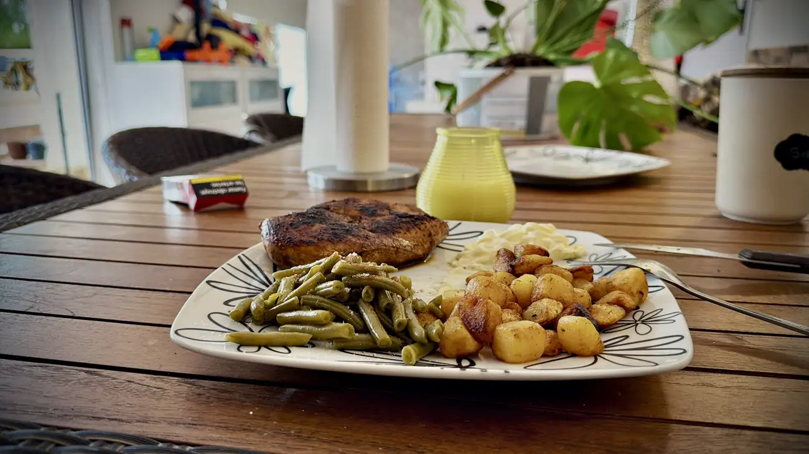
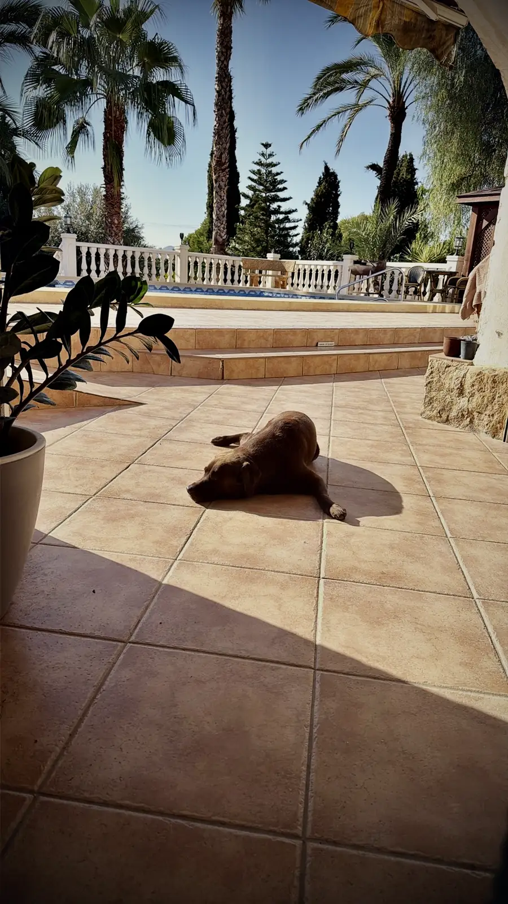
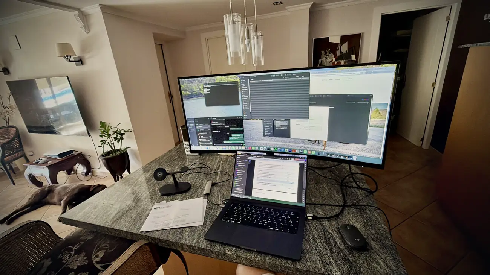
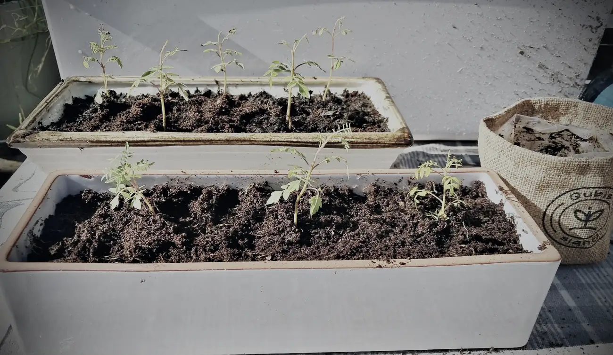

Inmiddels ben ik al ruim een week in Spanje en wat vliegt de tijd. Na aankomst heb ik eigenlijk niet echt kunnen rusten. Hoop te regelen, veel de deur uit. Leuk, maar tijdrovend.

Als je hier denkt dat je even naar de garage gaat om een auto te brengen, rond 2 uur 's middags, dan ben je zomaar om 9 uur 's avonds weer thuis.

Dat is wennen. Super leuk natuurlijk, maar me systeem is het niet gewend. In Nederland was ik veel binnen, hier ben ik alleen maar buiten. En het is hier nog steeds super warm.

Lopen doe ik 's ochtends met Mo, dan is het nog niet zo warm. Ik geniet dan van de bergen en denk: daar moet ik zijn.

Waar ik nu tijdelijk verblijf is mooi. Ik heb hier heel veel herinneringen, met me ouders en met de ouders van Pat. Dat maakt dat ik me hier echt thuis voel, maar niet op me plek. Ik ben nog steeds een soort van aan het zwerven en ik verlang naar een eigen plek.

Ondanks dat ben ik super dankbaar dat ik hier mag zijn, en dat ik hier niet helemaal alleen ben.

## Alleen

Gisterochtend heb ik me amigo naar het vliegveld gebracht. Sindsdien ben ik hier echt alleen.

Me bus staat helaas nog steeds stil. We hebben de laatste dagen zoveel gedaan dat er geen ruimte voor was. Ik rij nu met de scooter, of met een auto die ik hier mag gebruiken, maar die bus moet volgende week echt gemaakt worden.

Het rijden is hier even anders dan in Nederland. Smalle straatjes, gekke rotondes. Ik ken het, ik kom hier al jaren, maar in iemand anders zijn auto voelt dat niet fijn. En je bent afhankelijk.

Even naar de supermarkt doe je hier niet lopend. Het kan, maar dan ben je wel even onderweg. Je moet hier dingen gewoon anders inrichten.

Als je me nu vraagt wat ik de afgelopen dagen heb gedaan: eigenlijk alleen maar overal heen racen.

## Habla tranquilo, por favor

Wel goed voor me Spaans trouwens. Ik leer hier meer in een week dan in een half jaar Duolingo.

Sí, comprendo. ¿Cómo? Yo no comprendo. Habla tranquilo, por favor.

Spaans spreken is in het echt veel lastiger dan via een app. Hier gaat alles zo snel, en ze praten ook nog met een dialect. In Duolingo ben ik kampioen, maar hier is het hard werken. Zeker als je met wat locals in een bar zit.

Toch ben ik ervan overtuigd dat dat de beste manier is om het onder de knie te krijgen. En als je dan vraagt, habla un poco más tranquilo por favor, dan vinden ze dat leuk en doen ze hun best om het uit te leggen. Ik wil echt snel de taal leren, en als ze dat merken dan waarderen ze dat.

Het is zo leuk en leerzaam dat het weleens nachtwerk wordt. Het weekend was ik dan ook naar de conjo. Geen idee of dat Spaans is, maar zo voelde ik me.

Dus die 2 dagen rustig aan gedaan. Formule 1 gekeken, en verder alles tranquilo. Dat is wennen.

## Een Hollandse pot

Dat is denk ik ook de reden dat ik me sinds gisteren erg moe voel. Even geen bars. Werk opstarten. Zelf koken. Dat voelt fijn.

Ik heb gisteren natuurlijk een Hollandse pot gemaakt. Je hebt hier supermarkten die alleen Nederlandse producten verkopen. Alles van de Jumbo, ongelooflijk. Nu is de Jumbo niet goedkoop, en hier is alles nog net wat duurder. In de Spaanse supermarkten is alles een stuk goedkoper, maar eh. Me bordje met gebakken aardappelen, sperziebonen van Hak en echt een goed en lekker kipfiletje, daar moet je wat voor over hebben.

Leuk is ook dat ze je na een week in de supermarkt al beginnen te herkennen. Hola, ¿todo bien? Hasta mañana. Ik geniet van dat soort interacties en ik wil meer, maar alles op zijn tijd.

## Mo

Mo heeft het hier prima naar zijn zin. Hij heeft echt even moeten wennen, net als ik, maar het gaat elke dag beter. Zo af en toe een duik in het zwembad.

De vijver probeer ik te voorkomen. Maar het is logisch dat een labrador liever in een vijver springt dan in een chloorbad. Als je een retriever of een labrador blij wil maken, dan worden ze zo vies mogelijk. Ga dat maar eens afleren. Het gaat gelukkig de goede kant op. Het ruikt trouwens ook niet bepaald fijn. Maar het is warm voor dat beestje.

## Opstarten

De vermoeidheid van de afgelopen maanden komt er nu echt even uit. Maar het werk gaat door.

Werken op een klein laptopschermpje ging me irriteren, dus ik ben vanmorgen naar de Mediamarkt gereden en heb mezelf een upgrade gegeven. Rustig al het werk opstarten, en dan zien we wel waar we over een paar dagen staan. Ik hoop wat meer kracht en energie te krijgen.

Vandaag kreeg ik nog een leuke update van me bonusmoeder uit Monster waar ik heel blij van werd. Ze heeft me bonsaibaby's naar een nieuwe omgeving verplaatst en ze doen het super goed. Zo leuk om te zien. Een paar van die baby's komen straks naar Spanje, als ik weer in Nederland ben geweest.

## Code oranje

Ik zou vandaag ook naar Dees en Ray gaan, hier vlakbij. Die heb ik zo lang niet gezien en ik wil ze dolgraag knuffelen. Alleen zitten we hier nu met code oranje. Ik kreeg zelfs 2 keer een alert op me telefoon. Ze verwachten hier echt een hoop regen de komende week, maar tot nu toe valt het mee.

Ik hoop morgen even hun kant op te kunnen. Daar uiteraard een Nederlandse hap eten en een Spaanse cerveza.

Claro, no pasa nada.

Bedankt weer voor het lezen. Hasta pronto.
